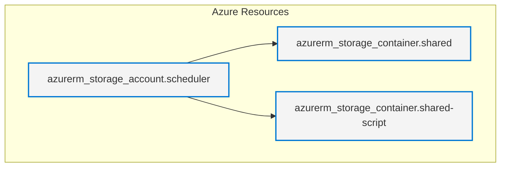
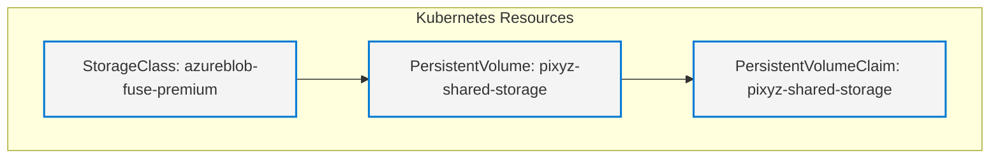
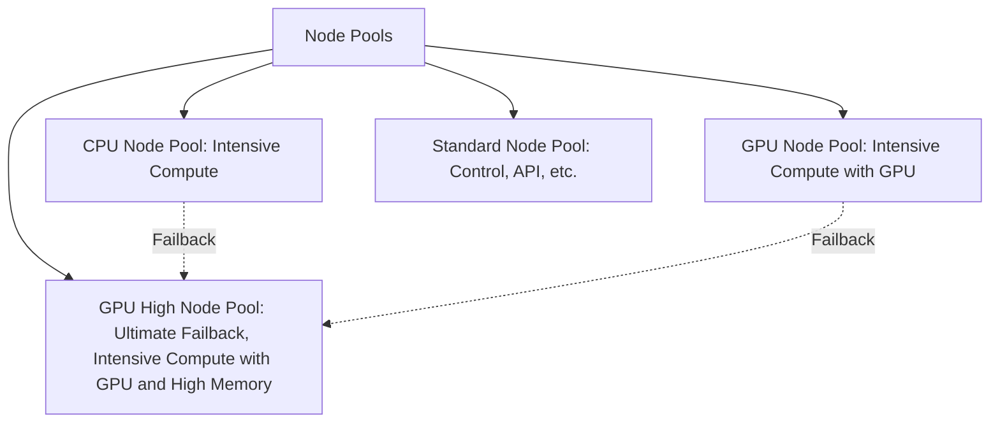

# PiXYZ Scheduler Kubernetes installation
You can install the PiXYZ Scheduler on a Kubernetes cluster. This installation is recommended for production environments that need scalability and cost optimization especially in cloud environments.

## Table of Contents
<!-- TOC -->
* [PiXYZ Scheduler Kubernetes installation](#pixyz-scheduler-kubernetes-installation)
  * [Table of Contents](#table-of-contents)
  * [Requirements](#requirements)
  * [Installation](#installation)
    * [Prepare a shared storage](#prepare-a-shared-storage)
      * [Purpose](#purpose)
      * [How to configure the shared storage](#how-to-configure-the-shared-storage)
      * [Example](#example)
        * [Azure Blob Storage](#azure-blob-storage)
          * [Terraform configuration](#terraform-configuration)
          * [Kubernetes configuration (Azure example)](#kubernetes-configuration-azure-example)
    * [Prepare your kubernetes node pool](#prepare-your-kubernetes-node-pool)
      * [Production node pools](#production-node-pools)
        * [Production node pools with cost optimization](#production-node-pools-with-cost-optimization)
      * [Example of node pools configuration with terraform for Azure](#example-of-node-pools-configuration-with-terraform-for-azure)
    * [Install redis](#install-redis)
      * [Example of redis server hosted by cloud provider (Azure Cache)](#example-of-redis-server-hosted-by-cloud-provider-azure-cache)
      * [Redis server in Kubernetes](#redis-server-in-kubernetes)
    * [Install Keda](#install-keda)
    * [Install license server](#install-license-server)
  * [Configure the PiXYZ Scheduler](#configure-the-pixyz-scheduler)
    * [The API](#the-api)
      * [The redis configuration](#the-redis-configuration)
      * [Monitoring configuration](#monitoring-configuration)
    * [The general configuration](#the-general-configuration)
      * [The PiXYZ Scheduler license server](#the-pixyz-scheduler-license-server)
      * [Shared storage configuration](#shared-storage-configuration)
    * [The Workers](#the-workers)
  * [Install the helm chart](#install-the-helm-chart)
  * [Prometheus metrics and logs](#prometheus-metrics-and-logs)
  * [Tips & Tricks](#tips--tricks)
    * [GPU node allocations](#gpu-node-allocations)
<!-- TOC -->

## Requirements
* A Kubernetes cluster
* HELM 3.0 or higher
* A docker registry with pixyz scheduler and api images
* A shared storage (Object storage with filesystem, NFS, Ceph, etc.)
* A Redis server
* KEDA v2.12 minimum installed on your Kubernetes cluster
* *Optional*: Prometheus metrics cluster
* A valid PiXYZ license key or a license server


## Installation
The PS installation is done using the Helm chart. The Helm chart is available in the docker registry: oci://registry-1.docker.io/pixyzinc/pixyz-scheduler.
But before installing the PiXYZ Scheduler, you must prepare:
* the shared storage: 
* a redis server inside or outside the Kubernetes cluster
* [KEDA](https://keda.sh/) operator
* *Optional*: [Prometheus metrics cluster operator](https://prometheus-operator.dev/)
### Prepare a shared storage
#### Purpose
The shared storage is used to store the PiXYZ Scheduler data and the PiXYZ API data. It can be an object storage with filesystem overlay, NFS, Ceph, etc. 
The shared storage must be accessible from all the Kubernetes nodes if you want to use the PiXYZ Scheduler in a distributed mode.

Note: If you don't have a shared storage (**This is not recommended for production environments**), each PS node must:
 * host an API server liked with the worker node (not supported in helm configuration).
 * listen to the `clean` queue for removing old data.
 * DAG mode should be limited to one node. 
 * no failover or redundancy available.

#### How to configure the shared storage
The shared storage must be mounted on each Kubernetes node at the same path. The path must be configured in the `values.yaml` file of the PiXYZ Scheduler Helm chart.
By default, the path is `'/app/share'` or `'/share'`. You must specify the persistent volume claim name in the `values.yaml` file:
```
pixyz_scheduler:
  storage:
    shared:
      persistentVolumeClaim: pixyz-shared-storage
```
This volume will be mounted on the `/app/share` path in the PiXYZ Scheduler & API container.

#### Example
##### Azure Blob Storage
In this example, we will use an Azure Blob Storage with a filesystem overlay. The storage account must be created in the same region as the Kubernetes cluster to avoid latency issues.
You can use the `azurerm_storage_account` and `azurerm_storage_container` resources to create the storage account and containers in Terraform. 


The storage account will be used to store:
* the PiXYZ Scheduler data (compute and script): `"shared"` 
* the API script (customer script): `"api"`.
###### Terraform configuration
```hcl
resource "azurerm_storage_account" "scheduler" {
  name                     = "scheduler"
  resource_group_name      = 'my-resource-group'
  location                 = 'my-location'
  account_kind             = "BlockBlobStorage"
  account_tier             = "Premium"
  account_replication_type = "LRS"
}

resource "azurerm_storage_container" "shared" {
  name                  = "shared"
  storage_account_name  = azurerm_storage_account.scheduler.name
  container_access_type = "private"
  depends_on            = [azurerm_storage_account.scheduler]
}

resource "azurerm_storage_container" "shared-script" {
  name                  = "shared-script"
  storage_account_name  = azurerm_storage_account.scheduler.name
  container_access_type = "private"
  depends_on            = [azurerm_storage_account.scheduler]
}
```

###### Kubernetes configuration (Azure example)
If you have a PS in the apps namespace, you have to create a persistent volume and a persistent volume claim to mount the Azure Blob Storage in the PiXYZ Scheduler container.


```yaml 
apiVersion: storage.k8s.io/v1
allowVolumeExpansion: true
kind: StorageClass
metadata:
  labels:
  name: azureblob-fuse-premium
mountOptions:
- -o allow_other
- --file-cache-timeout-in-seconds=120
- --use-attr-cache=true
- --cancel-list-on-mount-seconds=10
- -o attr_timeout=120
- -o entry_timeout=120
- -o negative_timeout=120
- --log-level=LOG_WARNING
- --cache-size-mb=1000
parameters:
  skuName: Premium_LRS
provisioner: blob.csi.azure.com
reclaimPolicy: Delete
volumeBindingMode: Immediate
---
apiVersion: v1
kind: PersistentVolume
metadata:
  annotations:
    pv.kubernetes.io/provisioned-by: blob.csi.azure.com
  name: pixyz-shared-storage
  namespace: apps
spec:
  capacity:
    storage: 50Gi
  accessModes:
    - ReadWriteMany
  persistentVolumeReclaimPolicy: Retain  # If set as "Delete" container would be removed after pvc deletion
  storageClassName: azureblob-fuse-premium
  mountOptions:
    - -o allow_other
# Maybe usefull for synchronization
#    - -o direct_io
    - --file-cache-timeout-in-seconds=120
  csi:
    driver: blob.csi.azure.com
    readOnly: false
    volumeHandle: pixyz-shared-storage
    volumeAttributes:
      storageAccount: scheduler
      containerName: shared
    nodeStageSecretRef:
      name: pixyz-shared-storage
      namespace: apps
---
apiVersion: v1
kind: PersistentVolumeClaim
metadata:
  name: pixyz-shared-storage
  namespace: apps
spec:
  accessModes:
    - ReadWriteMany
  resources:
    requests:
      storage: 50Gi
  volumeName: pixyz-api-storage-process
  storageClassName: azureblob-fuse-premium
```
### Prepare your kubernetes node pool
#### Production node pools
For production environment with GPU workload and without cost optimization, we recommend 4 nodes pools:
* cpu node pools (intensive compute)
* gpu node pools (intensive compute with GPU)
* standard node pools (for control, api, etc.)
* gpuhigh node pools (for ultimate failback, intensive compute with GPU and high memory)


##### Production node pools with cost optimization
For production environment with GPU workload and cost optimization, we recommend 2 additionnals nodes pools:
* gpu node pools on spot (intensive compute with GPU)
* cpu node pools on spot (intensive compute)

We don't recommend a spot node pool for the control worker node or gpuhigh worker node.

#### Example of node pools configuration with terraform for Azure
```hcl
# A default node pool for running users workloads
resource "azurerm_kubernetes_cluster_node_pool" "apps" {
  name                  = "apps"
  kubernetes_cluster_id = azurerm_kubernetes_cluster.aks.id
  vm_size               = "Standard_D2S_v5"
  vnet_subnet_id        = azurerm_subnet.aks_cluster.id

  enable_auto_scaling = true
  min_count           = 1
  max_count           = 3
  zones = ["1", "2", "3"]

  tags = local.resource_default_tags
}


# A node pool for GPU NOT IN SPOT
resource "azurerm_kubernetes_cluster_node_pool" "gpu" {
  name                  = "gpu"
  kubernetes_cluster_id = azurerm_kubernetes_cluster.aks.id
  vm_size               = "Standard_NC16as_T4_v3"
  vnet_subnet_id        = azurerm_subnet.aks_cluster.id

  enable_auto_scaling = true
  min_count           = 0
  max_count           = 5

  zones = ["1", "2", "3"]

  node_labels = {
    service = "gpu"
  }

  node_taints = [
    "sku=gpu:NoSchedule"
  ]

  tags = local.resource_default_tags
}

# A node pool for GPU worker on SPOT
resource "azurerm_kubernetes_cluster_node_pool" "gpuworker" {
  name                  = "gpuspot"
  kubernetes_cluster_id = azurerm_kubernetes_cluster.aks.id
  vm_size               = "Standard_NC16as_T4_v3"
  vnet_subnet_id        = azurerm_subnet.aks_cluster.id

  enable_auto_scaling = true
  min_count           = 0
  max_count           = 5
  priority            = "Spot"

  zones = ["1", "2", "3"]

  node_labels = {
    service = "gpu-spot"
  }

  node_taints = [
    "sku=gpu:NoSchedule",
    "worker=gpu:NoSchedule"
  ]

  tags = local.resource_default_tags
}

# node pool CPU SPOT
resource "azurerm_kubernetes_cluster_node_pool" "cpuspot" {
  name                  = "cpuspot"
  kubernetes_cluster_id = azurerm_kubernetes_cluster.aks.id
  vm_size               = "Standard_E16as_v5"
  vnet_subnet_id        = azurerm_subnet.aks_cluster.id

  enable_auto_scaling = true
  min_count           = 0
  max_count           = 5
  priority            = "Spot"

  zones = ["1", "2", "3"]

  node_labels = {
    service = "cpu-spot"
  }

  node_taints = [
    "worker=cpu:NoSchedule"
  ]

  tags = local.resource_default_tags
}

resource "azurerm_kubernetes_cluster_node_pool" "cpu" {
  name                  = "cpu"
  kubernetes_cluster_id = azurerm_kubernetes_cluster.aks.id
  vm_size               = "Standard_E16as_v5"
  vnet_subnet_id        = azurerm_subnet.aks_cluster.id

  enable_auto_scaling = true
  min_count           = 0
  max_count           = 5

  zones = ["1", "2", "3"]

  node_labels = {
    service = "cpu-worker"
  }

  node_taints = [
    "worker=cpu:NoSchedule"
  ]

  tags = local.resource_default_tags
}
```


### Install redis
In cloud environments, you can use a managed Redis service like Azure Cache for Redis or start your own Redis server in the Kubernetes cluster.
The redis server is responsible for storing the PiXYZ Scheduler state. It is used to store the DAGs, the compute jobs, and the API jobs.
If you lost the redis server, you will lose all jobs states: DAGs, compute and clean jobs.

#### Example of redis server hosted by cloud provider (Azure Cache)
This example shows how to create an Azure Cache for Redis instance using Terraform. You can adapt it to your cloud provider. This is the best practice for production environments.
```hcl
resource "azurerm_redis_cache" "example" {
  name                = "example-redis-cache"
  location            = azurerm_resource_group.example.location
  resource_group_name = azurerm_resource_group.example.name
  capacity            = 1                          # Cache size (1 = Basic C0, 2 = Basic C1, etc.)
  family              = "C"                        # C = Basic/Standard, P = Premium
  sku_name            = "Basic"                    # Basic, Standard, or Premium
}

output "redis_hostname" {
  value = azurerm_redis_cache.example.hostname
}

output "redis_port" {
  value = azurerm_redis_cache.example.port
}

output "redis_primary_key" {
  value = azurerm_redis_cache.example.primary_access_key
}

output "redis_secondary_key" {
  value = azurerm_redis_cache.example.secondary_access_key
}
```

#### Redis server in Kubernetes
This option is good enough for many workload but it requires more maintenance.
You can use the official Redis Helm chart to deploy a Redis server in your Kubernetes cluster. 

```bash
helm repo add bitnami https://charts.bitnami.com/bitnami
helm install -f redis-values.yaml redis bitnami/redis --version 20.9.0
```

You can find our standalone installation values.yaml for example [here](files/redis-values.yaml).

### Install Keda
The Keda software is used to scale the PiXYZ Scheduler worker nodes based on the number of jobs in the queue. 
It is required to run the PiXYZ Scheduler in a distributed and automatic scaling mode.

```bash
helm repo add keda https://kedacore.github.io/charts
helm install -f keda-values.yaml keda kedacore
```

You can find our standalone installation values.yaml for example [here](files/keda-values.yaml).
For more information about Keda, you can refer to the [Keda documentation](https://keda.sh/docs/latest/).


### Install license server
A PiXYZ Scheduler license server is required because each worker node execute a PiXYZ SDK instance

## Configure the PiXYZ Scheduler
To configure the PiXYZ Scheduler, you must use the `values.yaml` file provided with the helm recipe. 
This file contains all the configuration options for the PiXYZ Scheduler and API.

### The API
This is the entrypoint for the PiXYZ Scheduler. It is responsible for putting jobs in the queue.
The configuration is done in the `values.yaml` file under the `api` section, the most important options are:
 * passwordHash: The password hash to access the API. You can generate it using the command `echo -p "secret" | sha256sum`.
 * resources: The resource limits for the API container. It is recommended to set the memory to 1Gi and the CPU to 1000m.
 * proxy-body-size: The maximum size of the request body (including the uploaded files). It is recommended to set it to 1024m (if you have files under 1GB).

The ingress configuration depends on your ingress controller, you must adapt it to your ingress controller type.

````yaml
api:  
  enabled: true
  
  #>>>>>>>>>> calculated password hash to access to the API, example echo -p "secret" | sha256sum
  passwordHash: 19a31b9f2efa26adb3b06b79c9453032caaab64f78bf6cd65a91b53920e85782
  
  #>>>>>>>>>>> Resource limits for the API container
  resources:
    requests:
      memory: 1280Mi
      cpu: 500m
    limits:
      memory: 1Gi
      cpu: 1000m
  image:
    repository: pixyzinc/pixyz-scheduler-api:latest
    pullPolicy: IfNotPresent
    tag: "1.0.7"
  specs:
    replicas: 1
    # If you need a service account for storage access, etc...
    serviceAccountName: xxxx


  ingress:
    className: "nginx-private"
    tlsSecretName: "api-wildcard"

    # Optional additional annotations for your ingress (like cert-manager annotations)
    annotations:
      cert-manager.io/cluster-issuer: "letsencrypt"
      #>>>>>>>> Configure the maximum size of the request body (incluing the uploaded files)
      nginx.ingress.kubernetes.io/proxy-body-size: 1024m
      nginx.ingress.kubernetes.io/proxy-read-timeout: "600"
      nginx.ingress.kubernetes.io/proxy-send-timeout: "600"
      nginx.ingress.kubernetes.io/keepalive-timeout: "600"
      nginx.ingress.kubernetes.io/proxy-buffer-size: "128M"
      nginx.ingress.kubernetes.io/enable-cors: "true"
      nginx.ingress.kubernetes.io/cors-allow-origin: "*"
      nginx.ingress.kubernetes.io/cors-allow-methods: "PUT, GET, POST, OPTIONS, DELETE"
      nginx.ingress.kubernetes.io/client-body-buffer-size: "256M"
      nginx.ingress.kubernetes.io/cors-allow-headers: "Keep-Alive,User-Agent,X-Requested-With,If-Modified-Since,Cache-Control,Content-Type,X-Api-Key,Access-Control-Allow-Origin"
      nginx.ingress.kubernetes.io/configuration-snippet: |
        if ($http_x_forwarded_proto = 'http') {
          return 301 https://$host$request_uri;
        }
    hosts:
      - pixyz.production.unity.com
      - "*.pixyz.production.unity.com"
````
#### The redis configuration
The redis configuration is done in the `values.yaml` file under the `redis` section. The most important options are:
* host: The redis server hostname or IP address.
* port: The redis server port (default is 6379).
* enableTLS: Whether to enable TLS for the redis connection (default is false).
* database: The redis database to use (default is 0).
* passwordSecret: The secret containing the redis password. It must be a Kubernetes secret with the name and key specified in the `name` and `key` fields.

Example of redis configuration:
```yaml
  host: redis-master.apps.svc.cluster.local
  port: "6379"
  enableTLS: false
  database: 1
  passwordSecret:
    name: redis
    key: redis-password
```

The PiXYZ Scheduler will use 2 redis databases:
* Database A: For storing the jobs queue
* Database A0: For storing job results


For example, if you use the redis database 1, the PiXYZ Scheduler will use:
* Database 1 for the jobs queue
* Database 10 for the job results

#### Monitoring configuration
The monitoring configuration is done in the `values.yaml` file under the `monitoring` section. The most important options are:
* enabled: Whether to enable monitoring (default is false).
* basicAuth: The basic authentication for the monitoring dashboard. It must be in the format `username:password`.
* purge_offline_workers: The time in seconds to wait before removing offline workers from the dashboard (default is 1800 seconds or 30 minutes).

```yaml
monitoring:
  flower:
    enabled: true
    monitor: true
    purge_offline_workers: 1800 # Remove workers from the dashboard after 30 minutes of inactivity
    resources:
      limits:
        cpu: 1000m
        memory: 1Gi
      requests:
        cpu: 100m
        memory: 64Mi
    basicAuth: "pixyz:secret" # Basic auth for the flower dashboard
    ingress:
      className: "nginx-private"
      tlsSecretName: "api-wildcard"
      annotations:
        cert-manager.io/cluster-issuer: "letsencrypt"
      hosts:
        - flower.production.unity.com
        - "*.flower.production.unity.com"
```
If you enable this service, you will deploy a [Flower](https://flower.readthedocs.io/en/latest/) dashboard to monitor the PiXYZ Scheduler workers and jobs. 
If you want to export the metrics to Prometheus, please set the `monitor=true`

### The general configuration
You have to configure:
* The PiXYZ Scheduler license server
* The shared storage for the PiXYZ Scheduler
* The shared storage for the PiXYZ script if you use it.

#### The PiXYZ Scheduler license server
You must set the PiXYZ Scheduler license server in the `values.yaml` file under the `flexlm` section.
```yaml
pixyz_scheduler:
  flexlm:
    # The FlexLM license server host
    host: "flexlm.apps.svc.cluster.local"
    # The FlexLM license server port
    port: "27000"
    # Allocate a slot at startup or per jobs
    acquire_at_start: true
```
The `acquire_at_start` option is used to allocate a slot at startup or per jobs. If you set it to `true`, the PiXYZ Scheduler will allocate a slot at startup and release it when the worker is stopped. If you set it to `false`, the PiXYZ Scheduler will allocate a slot per job and release it when the job is finished.

#### Shared storage configuration
```yaml
pixyz_scheduler:
  storage:
    shared:
      persistentVolumeClaim: your-shared-storage-pvc
    process:
      persistentVolumeClaim: your-shared-script-pvc
```

### The Workers
The worker configuration is divided into several sections:
* Global configuration: This section contains the global configuration for the PiXYZ Scheduler and these workers. If you don't set additional configuration, the default values will be used.
  * image: The Docker image to use for the workers. You can specify the repository, pull policy, and tag.
  * metadata: The metadata for the workers, including labels and annotations.
  * spec: The Kubernetes pod specification for the workers, including service account name and termination grace period. 
  * resources: The resource requests and limits for the workers. 
  * maxTasksBeforeShutdown: The maximum number of tasks to process before shutting down the worker and restarting it.
  * autoScale: The auto scaling configuration for the workers, including polling interval and cooldown period.
  * cleanup: The cleanup configuration for the workers, including whether to enable cleanup and the time to wait before deleting the job data. This job is done by the `clean` worker.
* Workers and queue configuration: This section contains the configuration for each worker type (CPU, GPU, GPUHigh, Control) and with the associates working queues.
  * The control queue is mandatory for cleanup and zip tasks.
```yaml
  workers:
    ##
    ## DEFAULT AND GLOBAL CONFIGURATION
    ##
    default:
      image:
        repository: pixyzinc/pixyz-scheduler-worker:latest
        pullPolicy: IfNotPresent
        tag: latest
      metadata:
        labels:
          azure.workload.identity/use: "true"
        annotations:
          azure.workload.identity/inject-proxy-sidecar: "false"
      spec:
          serviceAccountName: ifyouneedit
          terminationGracePeriodSeconds: 2600
      resources:
        requests:
          memory: "16Gi"
          cpu: "2"
        limits:
          cpu: "15"
          memory: "64Gi"
      logLevel: "INFO"
      # For pixyz developers support only
      debug: false
      # The maximum number of tasks to process before shutting down the worker and restarting it
      # 0 by default for unlimited
      maxTasksBeforeShutdown: 1000
      autoScale:
        pollingInterval: 15
        cooldownPeriod: 60
    ##
    ## CLEANUP CONFIGURATION
    ##
    cleanup:
      # High recommended for production use, disabled for debugging purpose only
      enabled: true
      # The time to wait before deleting the job data
      # 1d by default
      ttl: 7200
    ##
    ## WORKER CONFIGURATION
    ##
    workers:
      ##
      ## CPU CONFIGURATION 
      ##
      cpu:
        spec:
        resources:
          requests:
            cpu: "2"
            memory: "8Gi"
          limits:
            cpu: "15"
            memory: "64Gi"
        # Queue to listen to
        queues:
          - cpu
        # Auto scaling configuration
        autoScale:
          listName: "cpu"
          listLength: 1
          maxReplicaCount: 35
          minReplicaCount: 0
        logLevel: "INFO"
        maxTasksBeforeShutdown: 1000
      ##
      ## GPU CONFIGURATION 
      ##
      gpu:
        spec:
        resources:
          requests:
            cpu: "2"
            memory: "16Gi"
            nvidia.com/gpu: "1"
          limits:
            cpu: "15"
            memory: "90Gi"
            nvidia.com/gpu: "1"
        queues:
          - gpu
        autoScale:
          listName: "gpu"
          listLength: 1
          maxReplicaCount: 36
          minReplicaCount: 0
      gpuhigh:
        spec:
        resources:
          requests:
            cpu: "15"
            memory: "90Gi"
            nvidia.com/gpu: "1"
          limits:
            cpu: "15"
            memory: "100Gi"
            nvidia.com/gpu: "1"
        queues:
          - gpuhigh
        autoScale:
          listName: "gpuhigh"
          listLength: 1
          maxReplicaCount: 1
          minReplicaCount: 0
      control:
        # This worker is used to control the other workers or for running management tasks
        disablePixyz: true
        # You can't specify a poolSize if pixyz is not disabled
        concurrentTasks: 5
        resources:
          requests:
            cpu: "100m"
            memory: "500Mi"
          limits:
            cpu: "15"
            memory: "4Gi"
        queues:
          - clean
          - zip
          - control
        logLevel: "INFO"
        maxTasksBeforeShutdown: 1000
        autoScale:
          listName: "control"
          listLength: 4
          maxReplicaCount: 10
          minReplicaCount: 0

```
## Install the helm chart
To install the PiXYZ Scheduler Helm chart, you can use the OCI feature:

```bash
helm install -f values.yaml pixyz-scheduler oci://registry-1.docker.io/pixyzinc/pixyz-scheduler --version 1.0.1
```

## Prometheus metrics and logs
_comming soon..._

## Tips & Tricks
### GPU node allocations
If you want to use GPU nodes for the PS worker node, you must:
* configure the GPU node selector in the `values.yaml`
* configure the nvidia driver to share the GPU resources with the Kubernetes cluster except if you need one GPU per PS worker.
The following example shows how to configure the GPU node selector and the nvidia driver in the `values.yaml` under azure cloud.

```yaml
# Configuration for the nvidia device plugin
apiVersion: v1
kind: ConfigMap
metadata:
  name: nvidia-config
  namespace: kube-system
data:
  nvidia-config.yaml: |
    version: v1
    flags:
      migStrategy: "none"
      failOnInitError: true
      nvidiaDriverRoot: "/"
      plugin:
        passDeviceSpecs: false
        deviceListStrategy: "envvar"
        deviceIDStrategy: "uuid"
    sharing:
      timeSlicing:
        renameByDefault: false
        resources:
        - name: nvidia.com/gpu
          # HERE:  This is the total number of GPUs allocatable per node (Number of PS worker on GPU node <= 16)
          replicas: 16
---
# Apply to each node with GPU
apiVersion: apps/v1
kind: DaemonSet
metadata:
  name: nvidia-device-plugin-daemonset
  namespace: kube-system
spec:
  selector:
    matchLabels:
      name: nvidia-device-plugin-ds
  updateStrategy:
    type: RollingUpdate
  template:
    metadata:
      labels:
        name: nvidia-device-plugin-ds
    spec:
      tolerations:
      # Allow this pod to be rescheduled while the node is in "critical add-ons only" mode.
      # This, along with the annotation above marks this pod as a critical add-on.
      # Permit execution on spot nodes.
      - key: CriticalAddonsOnly
        operator: Exists
      - key: nvidia.com/gpu
        operator: Exists
        effect: NoSchedule
      - key: "sku"
        operator: "Equal"
        value: "gpu"
        effect: "NoSchedule"
      # Mark this pod as a critical add-on; when enabled, the critical add-on
      # scheduler reserves resources for critical add-on pods so that they can
      # be rescheduled after a failure.
      # See https://kubernetes.io/docs/tasks/administer-cluster/guaranteed-scheduling-critical-addon-pods/
      priorityClassName: "system-node-critical"
      containers:
      - image: nvcr.io/nvidia/k8s-device-plugin:v0.14.1
        name: nvidia-device-plugin-ctr
        env:
          - name: FAIL_ON_INIT_ERROR
            value: "false"
          - name: CONFIG_FILE
            value: /etc/nvidia-config.yaml
        securityContext:
          allowPrivilegeEscalation: false
          capabilities:
            drop: ["ALL"]
        volumeMounts:
        - name: device-plugin
          mountPath: /var/lib/kubelet/device-plugins
        - mountPath: "/etc/nvidia-config.yaml"
          subPath: nvidia-config.yaml
          name: nvidia-config
          readOnly: true
      volumes:
      - name: device-plugin
        hostPath:
          path: /var/lib/kubelet/device-plugins
      - name: nvidia-config
        configMap:
          name: nvidia-config
```