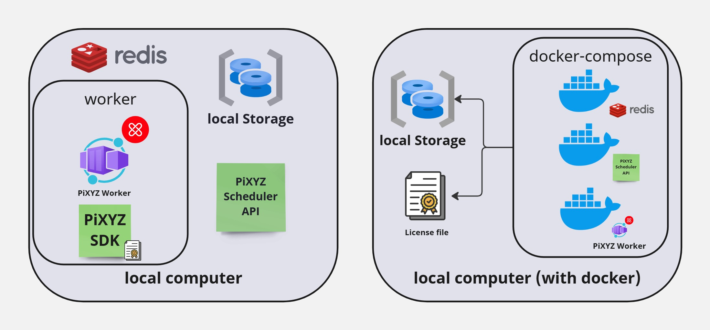

# Pixyz Scheduler Local Installation   

<!-- TOC -->
* [Pixyz Scheduler Local Installation](#pixyz-scheduler-local-installation-)
  * [Local Installation vs Docker Installation (Pros & Cons)](#local-installation-vs-docker-installation-pros--cons)
  * [Standalone Mode (Without Docker)](#standalone-mode-without-docker)
    * [Requirements](#requirements)
      * [Installation](#installation)
        * [From Source](#from-source)
        * [From Packages](#from-packages)
    * [Start the API and Worker](#start-the-api-and-worker)
      * [API](#api)
      * [Worker](#worker)
      * [Start the monitoring page (optional)](#start-the-monitoring-page-optional)
    * [Test the installation](#test-the-installation)
  * [Standalone mode (with docker)](#standalone-mode-with-docker)
    * [Pros vs cons:](#pros-vs-cons)
    * [Requirements](#requirements-1)
    * [Configuration](#configuration)
      * [(optional) For image build](#optional-for-image-build)
    * [Start the services](#start-the-services)
      * [Default configuration](#default-configuration)
      * [Advanced configuration](#advanced-configuration)
* [Configure the Pixyz Scheduler](#configure-the-pixyz-scheduler)
  * [Setup the redis](#setup-the-redis)
    * [Redis server](#redis-server)
      * [Linux](#linux)
      * [Windows](#windows)
  * [FAQ](#faq)
    * [Windows](#windows-1)
<!-- TOC -->

In local installation mode, the API and the workers are running on the same machine. This mode is useful for testing and debugging your scripts before running them on a remote server.

In the following diagram, we have two scenarios:
* **Local Install**: The API and the workers are running on the same machine directly from the source.
* **Local with Docker**: The API and the workers are running on the same machine directly from containers.
* 

## Local Installation vs Docker Installation (Pros & Cons)

   * **Pros**:
      * Local debugging is possible.
      * You can choose your Pixyz SDK (including alpha versions).
      * GPU integration is available for Windows hosts.
   * **Cons**:
      * More complex to set up.

## Standalone Mode (Without Docker)

### Requirements
1. Create your virtual environment for API and worker: 
   * Install `distutils` for Linux: `sudo apt-get install python3-distutils` or similar for Windows.
   * `python -m venv venv`
   * `source venv/bin/activate` (Linux) or `.\venv\Scripts\Activate` (Windows)
2. Install Redis: 
   * Windows: Redis on Windows is officially supported through WSL2. Please follow these [instructions for Windows](https://redis.io/docs/latest/operate/oss_and_stack/install/install-redis/install-redis-on-windows/).
   * Linux: `sudo apt-get install redis-server` (or similar for other distributions).

#### Installation
##### From Source
1. Install Python requirements from the `requirements.txt` file: 
   * `pip install -r pixyz_api/requirements.txt`
   * `pip install -r pixyz_worker/requirements.txt`

##### From Packages
1. Install Python packages from a package manager:
   * `pip install pixyz_worker-2025.2.0.1-py3-none-any.whl`
   * `pip install pixyz_api-1.0.7-py3-none-any.whl`

Or from a public Python artifactory:
   * `pip install --extra-index-url https://unity3ddist.jfrog.io/artifactory/api/pypi/pixyz-pypi-prod-local/simple pixyz_worker`
   * `pip install --extra-index-url https://unity3ddist.jfrog.io/artifactory/api/pypi/pixyz-pypi-prod-local/simple pixyz_api`

On a local machine, you don't need shared storage; a local folder is sufficient (`./share`).

> **Note:** If you are running Pixyz Scheduler under Windows, you must run all commands under a PowerShell command line.

### Start the API and Worker

**Before starting the API and the worker, please make sure you have set the environment variables in your shell or in the `pixyz-scheduler.conf` file and that the Redis server is up and running.**
See the [Configure the Pixyz Scheduler](./ps_setup.md)

#### API
```bash
python api.py 
INFO:     Started server process [2064]
INFO:     Waiting for application startup.
INFO:     Application startup complete.
INFO:     Uvicorn running on http://0.0.0.0:8001 (Press CTRL+C to quit)
```

#### Worker
```bash
python worker.py 
[2024/12/11 10:09:19] Pixyz ComputeEngine v2024.2.0.19
 
 -------------- worker@bear v5.3.6 (emerald-rush)
--- ***** ----- 
-- ******* ---- Linux-6.1.0-18-amd64-x86_64-with-glibc2.36 2024-12-11 10:09:20
- *** --- * --- 
- ** ---------- [config]
- ** ---------- .> app:         __main__:0x7fd963657bd0
- ** ---------- .> transport:   redis://:**@127.0.0.1:6379/0
- ** ---------- .> results:     redis://:**@127.0.0.1:6379/0
- *** --- * --- .> concurrency: 5 (prefork)
-- ******* ---- .> task events: ON
--- ***** ----- 
 -------------- [queues]
                .> clean            exchange=clean(direct) key=clean
                .> control          exchange=control(direct) key=control
                .> cpu              exchange=cpu(direct) key=cpu
                .> gpu              exchange=gpu(direct) key=gpu
                .> gpuhigh          exchange=gpuhigh(direct) key=gpuhigh
                .> zip              exchange=zip(direct) key=zip

[tasks]
  . cleanup_share_file
  . package_outputs
  . pixyz_execute
  . sleep

[2024/12/11 10:09:20] Pixyz ComputeEngine v2024.2.0.19
...
```

#### Start the monitoring page (optional)
You can start the monitoring page with the following command:
```bash
celery -A pixyz_worker:app flower --purge_offline_workers=180 --loglevel=info -Q gpu,cpu,control,gpuhigh,zip,clean
```
Or if you don't need specific command line arguments, you can use the default command:`
```bash 
python flower.py
```

### Test the installation
Now, you are ready to [test the installation](./test_install.md).

## Standalone mode (with docker)
The quickest way to set up the Pixyz Scheduler

### Pros vs cons:

   * **Pros**:
      * Easy to set up
      * Easy to maintain
      * Easy to scale
      * Same environment than the production (redis backend)
   * **Cons**:
      * No direct debugging from source
      * Pixyz SDK version is fixed by the docker image
      * No GPU function available on Windows platform (need a dedicated Linux or run from local stack)

### Requirements
* Docker
  * **Windows**: [Docker desktop](https://docs.docker.com/desktop/install/windows-install/) (recommended with WSL2 integration)
  * **Linux**: [Docker engine](https://docs.docker.com/engine/install/) with [NVidia container toolkit](https://docs.nvidia.com/datacenter/cloud-native/container-toolkit/latest/install-guide.html) for GPU integration
  * **MacOS (x86_64)**: [Docker desktop](https://docs.docker.com/desktop/install/mac-install/) (no GPU available) **It will not work on M1 macs**
* [docker-compose v2.24.5 or higher](https://docs.docker.com/compose/install/)
* a Pixyz **flexLM** license (a *NodeLock* license will **NOT** work with docker)
* (optional) NVIDIA container toolkit docker extension for GPU acceleration/workload

### Configuration
1. Please make sure you have completed the `pixyz-scheduler.conf` and `.env` file with the correct values (you can copy the `pixyz-scheduler.conf.example` file to `pixyz-scheduler.conf` and edit the values):
* `DOCKER_REDIS_IMAGE` the redis container to use (`redis:latest`)
* `DOCKER_API_IMAGE` the Pixyz API container (`pixyzinc/pixyz-scheduler-api:latest`)
* `DOCKER_WORKER_IMAGE` the Pixyz WORKER container (`pixyzinc/pixyz-scheduler-worker:latest`)* 

2. Please set the `PIXYZ_PYTHON_PATH=/opt/pixyz` inside the `pixyz-scheduler.conf` because in docker mode, the pixyz sdk is already included inside the image.
* `LICENSE_FLEXLM`: you **must** set to true with docker, false in node lock without docker
* `LICENSE_HOST`: the name of the flexlm license server
* `LICENSE_PORT`: the tcp port of the flexlm license server
* `LICENSE_ACQUIRE_AT_START`: yes if you want to acquire the license at the start of the API and worker, no if you want to acquire the license only when needed (default: yes)

#### (optional) For image build
If you plan to build the image from the source:
* PIXYZ_IMAGE_BASE: the pixyz base image to use for worker (`pixyzinc/sdk`)
* PIXYZ_IMAGE_VERSION: The version according to the base image (`2025.2.0.1`)

### Start the services
#### Default configuration
1. Start the docker engine
2. Start the services with the default configuration:
  * 1 API WEB: http://localhost:8001
  * 1 REDIS: internal redis server
  * 1 WORKERS (SOLO + CONTROL QUEUE)
  * 0 WORKER (GPUHIGH): dedicated to the gpuhigh queue (heavy task like pixyz_execute, ...)
  * 0 FLOWER: monitoring page
```bash
docker-compose up
```

#### Advanced configuration
1. Start the docker engine
2. Start the services with you own configuration:
  * 1 API WEB: http://localhost:8001
  * 1 REDIS: internal redis server
  * 1 WORKER CONTROL: dedicated to the control queue (clean, package_outputs, ...)
  * 3 WORKERS (SOLO + CONTROL QUEUE)
  * 1 WORKER (GPUHIGH): dedicated to the gpuhigh queue (heavy task like pixyz_execute, ...)
  * 1 FLOWER: monitoring page

```bash
docker-compose up --scale worker=3 --scale gpuhigh=1 --scale flower=1 --scale control=1
```

# Configure the Pixyz Scheduler
You can configure the Pixyz Scheduler in two ways:
 * Using the environment variables
 * Using the configuration file `pixyz-scheduler.conf` file located in this order:
    * $PWD/pixyz-scheduler.conf`
    * windows:
      * `%APPDATA%/PixyzSDK/pixyz-scheduler.conf`
      * `%ProgramData%/PixyzSDK/pixyz-scheduler.conf`
    * linux:
      * `/etc/pixyz-scheduler.conf`

You can copy the `pixyz-scheduler.conf.example` file to `pixyz-scheduler.conf` and edit the values.

For a local installation, please set: 
 * `PIXYZ_PYTHON_PATH`: The Pixyz Scheduler needs to know where the Pixyz SDK is installed. Please make sure your installation is properly set up before starting the services (`PiXYZFinishInstall`/`PiXYZInstallLicense`).
 * `PROCESS_PATH`: This directory contains all pre-defined scripts.
 * `SHARE_PATH`: This directory is used to store the shared files between the API and the workers. Please choose a directory that is accessible by both the API and the workers.

## Setup the redis
### Redis server
The redis server will store the tasks and the results. The Pixyz Scheduler API will use it to communicate with the workers.
The celery framework may work with other backend, but the Pixyz Scheduler is configured to work with Redis by default.

#### Linux
1. Start your redis server: `sudo systemctl start redis-server`. By default, the server is listening on `localhost:6379` and no password is required.
2. Testing your redis connection: `redis-cli -h 127.0.0.1 ping` should return `PONG`.
3. If you want to setup a password, you can edit the `/etc/redis/redis.conf` file and add the line `requirepass your_password`. Don't forget to restart the server after the change: `sudo systemctl restart redis-server`.

#### Windows
The above command will work on windows under [WSL2 environment](https://redis.io/docs/latest/operate/oss_and_stack/install/install-redis/install-redis-on-windows/)

Note: If you plan to use many instances, you must change the maximum `databases` parameters to `99` or more in the `redis.conf` file.

## FAQ
### Windows
ERROR:    [WinError 10013] An attempt was made to access a socket in a way forbidden by its access permissions.

Change the API_PORT variable because you are trying to bind to a port that is already in use.