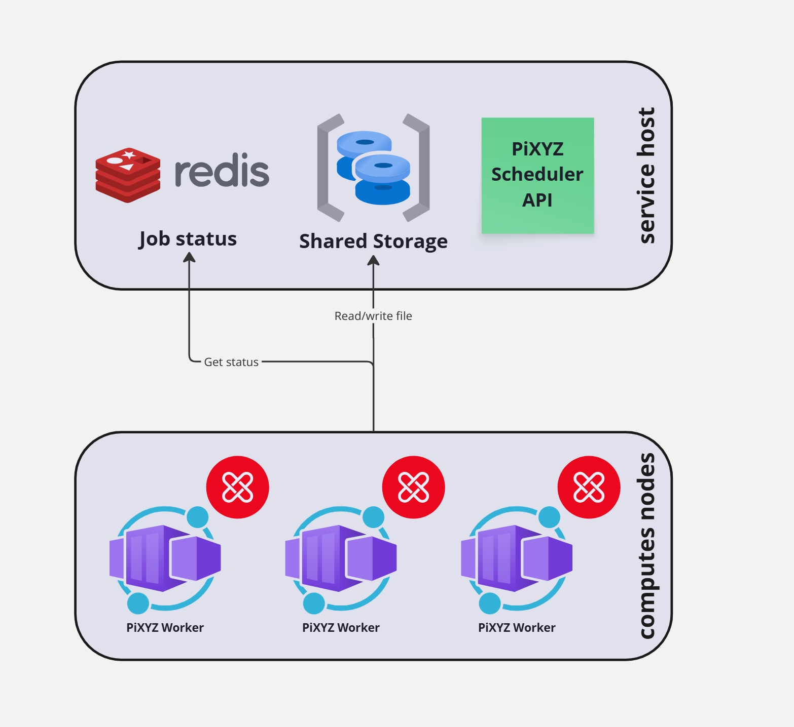

# Multiple node installation
The multiple node installation allows you to run the API and workers on different nodes. This is useful for scaling the system and separating concerns. 
The installation process is similar to the single node installation, but with some additional steps to configure the nodes: a shared storage and a redis server accessible from all nodes.

## Central components

### Shared storage
Configure a shared storage available from all nodes (NFS, GlusterFS, etc.). We recommend to synchronize/flush data to disk after each write operation or get a shared technology that does it automatically.

### Redis server
Install a Redis server that is accessible from all nodes. You can use a managed Redis service or install it on one of the nodes. Make sure to configure the Redis server to allow connections from all nodes.
If you need redondancy and high availability, you can use a Redis cluster or a Redis Sentinel setup.

## Installation tips
- Keep one directory per worker type, in this case you can use a different `pixyz-scheduler.conf` configuration per worker type.

## Example of setup
* 