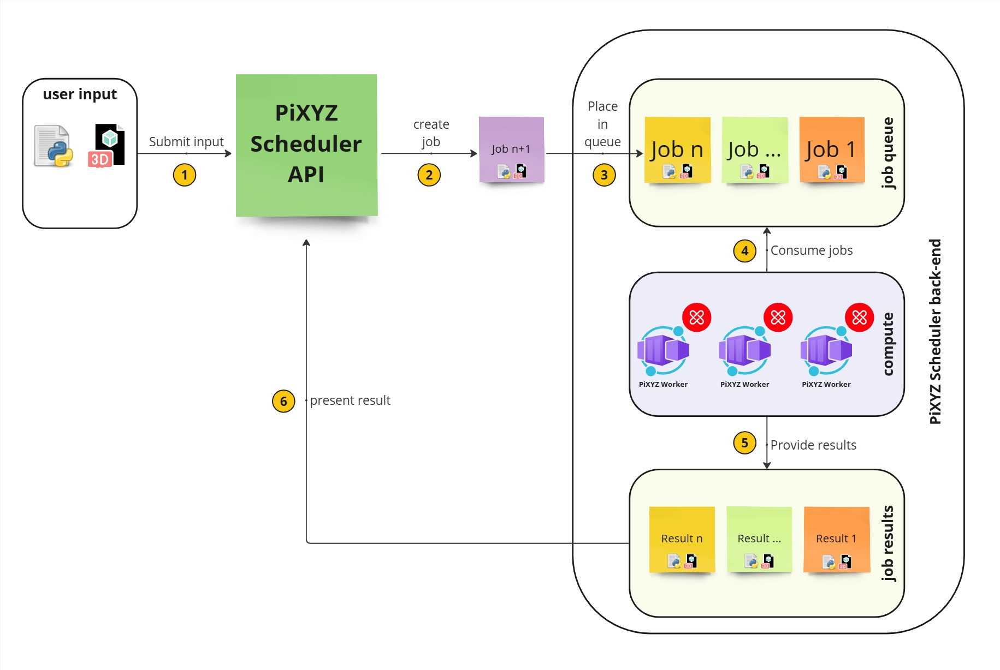
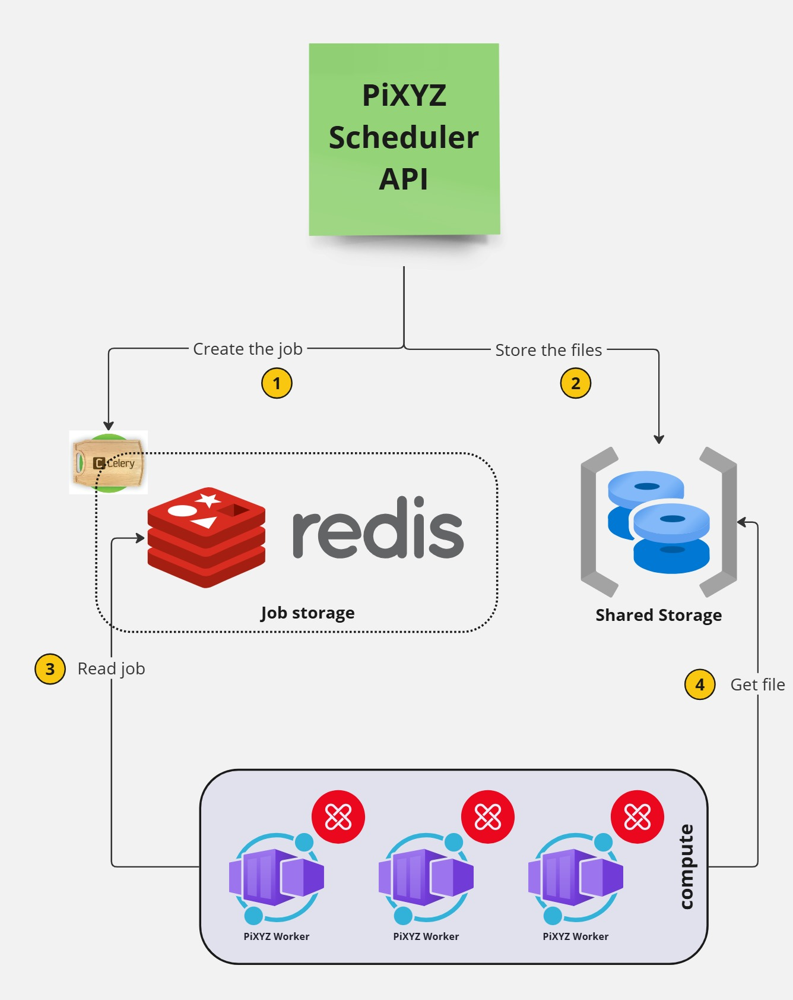

# Pixyz Scheduler Setup
<!-- TOC -->
* [Pixyz Scheduler Setup](#pixyz-scheduler-setup)
  * [Introduction](#introduction)
  * [Key concepts](#key-concepts)
  * [Features](#features)
  * [Requirements](#requirements)
    * [For all environments](#for-all-environments)
    * [Requirements & Feature limitation](#requirements--feature-limitation)
      * [Requirements](#requirements-1)
      * [Feature limitation](#feature-limitation)
  * [Installation & Configuration](#installation--configuration)
    * [Local installation](#local-installation)
    * [Multiple node installation](#multiple-node-installation)
    * [Kubernetes installation](#kubernetes-installation)
    * [Configuration](#configuration)
* [Configuration Documentation](#configuration-documentation)
  * [Table of Contents](#table-of-contents)
  * [Redis Configuration](#redis-configuration)
    * [Master Redis Service](#master-redis-service)
    * [Authentication](#authentication)
    * [Optional Redis Database](#optional-redis-database)
  * [License Configuration](#license-configuration)
    * [FlexLM Licensing](#flexlm-licensing)
    * [Token Management](#token-management)
  * [API Configuration](#api-configuration)
    * [API Password](#api-password)
    * [API Listen Port](#api-listen-port)
  * [Standalone & Multinode Configuration](#standalone--multinode-configuration)
    * [Shared Volumes](#shared-volumes)
  * [Docker Configuration](#docker-configuration)
    * [Docker Images](#docker-images)
    * [Permissions](#permissions)
    * [Build Configuration](#build-configuration)
  * [Worker Configuration](#worker-configuration)
    * [Logging and Debugging](#logging-and-debugging)
    * [Memory Usage](#memory-usage)
    * [Task Management](#task-management)
  * [Cleanup Configuration](#cleanup-configuration)
    * [Cleanup Settings](#cleanup-settings)
  * [Shared Content Configuration](#shared-content-configuration)
    * [Shared Paths](#shared-paths)
<!-- TOC -->

## Introduction
The pixyz-scheduler is a powerful toolkit designed for orchestrating and executing decentralized tasks across a network of specialized workers. 
Tailored for seamless integration with the (pixyz) framework, this toolkit empowers users to effortlessly submit jobs to distributed workers via an intuitive HTTP API.

Each worker operates independently to execute assigned tasks, with jobs routed to specific queues based on their computing needs, such as cpu or gpu. 
Workers actively monitor these queues for incoming assignments, ensuring efficient task allocation and execution. 
Leveraging the robust Celery framework, the pixyz-scheduler efficiently manages and coordinates workers, guaranteeing smooth task execution.


## Key concepts
The Pixyz Scheduler uses the producer-consumer pattern to distribute tasks to workers.



1. The user submits a **task**/**job** defined by a python script and if needed a 3D file, and it put it through the **HTTP API**.
2. The Pixyz Scheduler create a **task**/**job**
3. The new **jobs** is placed to the requested **queue**.
4. The **workers** are listening to new tasks in the queue(s) and process them according to their priorities.
5. The **workers** execute the task and save the result
6. The **API** can read the result and send it back to the user.

## Features
* **HTTP Rest API** to submit jobs
* Start using it with a **local** installation, execute on a **remote** environment, and **scale** to several workers nodes
* Compatible with **Workstation**, **Bare-metal/On-premise** computer and **Kubernetes** with auto-scaling and down-scaling for cost optimization
* Distribute tasks to workers based on their **capabilities** (CPU, GPU, ...) and **priorities**
* **Fault-tolerant** with **auto-retry** mechanism
* **Low latency** job scheduling (< 100ms).

## Requirements
You have two possibles modes with docker or without Docker. See the Usage and limitation to know which one is the best for you. 


 ### For all environments
  * Linux, Windows or macOS
  * a valid Pixyz license key or a license server
  * Python compatible or docker compatible

 ### Requirements & Feature limitation

 #### Requirements

| Mode         | Usage                                                  | Requirements                                                                                               | Execution mode <BR> recommendation                       |
|--------------|--------------------------------------------------------|------------------------------------------------------------------------------------------------------------|----------------------------------------------------------|
| *Standalone* | Testing and tweaking script before remote execution    | nothing                                                                                                    | direct from source or with docker                        |
| *Multi-host* | Worker hardware fault tolerance & horizontal scaling   | Shared storage + redis                                                                                     | docker <BR>or direct from source on windows GPU workload |
| *Kubernetes* | Auto-scaling, cost optimization, high availability     | Shared storage + redis <BR> Keda, helm and a Kubernetes cluster <BR>*optional*: prometheus metrics cluster | none                                                     |

Please note that you can't execute graphical tasks on a Windows worker with docker. You need to use the standalone mode.

 #### Feature limitation
The most important feature are:
* python debugger: you can use a native python debugger to debug your script and/or Pixyz scheduler itself.
* watchdog: you can use a watchdog to monitor the worker and restart the current task on other worker. The watchdog process is started after the worker process. If the watchdog find a "job trace file" (in the /tmp directory). The watchdog will restart the job on another worker.
* memory guard (**linux only**): you can use a memory guard to monitor the worker, kill the task that consume too much ram and restart the current task on other worker (with more memory). 
* solo mode: the celery framework support different mode. The solo mode starts only one process/thread for the worker instead of the prefork mode. We highly recommend to use the solo mode for pixyz job.
You have different level of feature regarding the used technology:

| Mode                     | python debugger  | watchdog           | memory guard                             | auto scaling | 
|--------------------------|------------------|--------------------|------------------------------------------|--------------|
| *Standalone from source* | YES              | NO                 | you must configure by yourself (ulimit)  | NO           |
| *docker*                 | NO               | YES                | YES                                      | NO           |
| *docker compose*         | NO               | YES                | YES                                      | manual       |
| *kubernetes*             | NO               | YES                | YES                                      | YES          |


## Installation & Configuration


Whatever the installation mode, it contains 3 parts:
 * **API** server that receives the jobs (your script and 3D file) and manage it throughout its life cycle. It offers an HTTP interface between you and the backend workers. The API servers create a job into the [celery sub-system](https://docs.celeryq.dev/en/stable/) (1) and store all needed data into a shared storage (2) available from the API and the backend.
 * **Workers** listens the celery queue and execute the jobs (3). All inputs and output data are stored into a share storage (4).

### Local installation
[Local installation for single instance or developer mode](./local_install.md)

### Multiple node installation
[Network installation for multiple instance](./multi_install.md)

### Kubernetes installation
[Kubernetes installation](./kubernetes_install.md)

### Configuration
# Configuration Documentation

This documentation provides a detailed explanation of the configuration parameters required for standalone, multinode, and Docker multi-host setups. Descriptions and explanations from the original configuration file have been included to ensure clarity. Any grammatical errors have been corrected.

---

## Table of Contents
1. [Redis Configuration](#redis-configuration)
2. [License Configuration](#license-configuration)
3. [API Configuration](#api-configuration)
4. [Standalone & Multinode Configuration](#standalone--multinode-configuration)
5. [Docker Configuration](#docker-configuration)
6. [Worker Configuration](#worker-configuration)
7. [Cleanup Configuration](#cleanup-configuration)
8. [Shared Content Configuration](#shared-content-configuration)

## Redis Configuration

### Master Redis Service
- **Host**: `REDIS_MASTER_SERVICE_HOST="127.0.0.1"`
  - The IP address of the Redis master service.
- **Port**: `REDIS_MASTER_SERVICE_PORT="6379"`
  - The port number where the Redis master service is listening.

### Authentication
- **Password**: `REDIS_PASSWORD=""`
  - If Redis requires a password for authentication, set it here. Leave it empty if authentication is not enabled.

### Optional Redis Database
- **Database Prefix**: `REDIS_DATABASE="0"`
  - The Redis database prefix defines where the queue and result data are stored:
    - **Database "0"**: Default queue database.
    - **Database "00"**: Default result database.
  - If multiple instances of the scheduler use the same Redis database, set different prefixes. Ensure the `database` value is updated in the `redis.conf` file.

## License Configuration

### FlexLM Licensing
- **Enable FlexLM Licensing**: `LICENSE_FLEXLM=true`
  - Set to `true` to enable FlexLM licensing, which is mandatory for Docker setups.
- **License Server Host**: `LICENSE_HOST=license.example.com`
  - The hostname of the FlexLM license server.
- **License Server Port**: `LICENSE_PORT=27000`
  - The TCP port used by the FlexLM license server.

### Token Management
- **Acquire Tokens at Start**: `LICENSE_ACQUIRE_AT_START=true`
  - When enabled, all tokens will be reserved for the worker before it starts. If disabled, token management must be handled manually.

---

## API Configuration

### API Password
- **Hashed Password**: `GOD_PASSWORD_SHA256=""`
  - **Important**: You **must** set a password. All API requests require authentication using this hashed password.
  - **How to Generate a Hashed Password**:
    - On Linux:
      ```bash
      echo -n "your_password" | sha256sum
      ```
    - On Windows:
      ```powershell
      $mystring = "your_password"
      $mystream = [IO.MemoryStream]::new([byte[]][char[]]$mystring)
      Get-FileHash -InputStream $mystream -Algorithm SHA256
      ```

### API Listen Port
- **Port**: `API_PORT=8001`
  - The port on which the API listens. By default, it listens on all interfaces.

---

## Standalone & Multinode Configuration

### Shared Volumes
- **Shared Volume Path**: `SHARE_PATH="/tmp/share"`
  - The directory path used to share files between the API and the worker.
- **Shared Process Scripts Path**: `PROCESS_PATH="/mydirectory/process"`
  - The directory path where process scripts are stored. 
  - **Default**: `<package_pixyz_api>/process`. This directory contains sample process scripts, but you can set a custom directory if developing your own scripts.

---

## Docker Configuration

### Docker Images
- **Redis Image**: `DOCKER_REDIS_IMAGE="redis:latest"`
  - The Docker image used for Redis.
- **API Image**: `DOCKER_API_IMAGE="pixyzinc/pixyz-scheduler-api:latest"`
  - The Docker image used for the Pixyz Scheduler API.
- **Worker Image**: `DOCKER_WORKER_IMAGE="pixyzinc/pixyz-scheduler-worker:latest"`
  - The Docker image used for workers.

### Permissions
- **UID**: `UID=1001`
  - The user ID for setting permissions on the shared volume.
- **GID**: `GID=1001`
  - The group ID for setting permissions on the shared volume.
  - **Important**: Ensure the UID and GID match the user accessing the shared volume. If permissions are incorrect, the shared directory will be read-only.

### Build Configuration
- **Pixyz Python Path**: `PIXYZ_PYTHON_PATH="/opt/pixyz"`
  - The path to the Pixyz Python installation.
- **Base Image**: `PIXYZ_IMAGE_BASE="pixyzinc/sdk:2025.2.0.1"`
  - The base image used for rebuilding the Docker image locally.
- **Image Version**: `PIXYZ_IMAGE_VERSION="latest"`
  - The version of the Pixyz image.

---

## Worker Configuration

### Logging and Debugging
- **Log Level**: `LOG_LEVEL=INFO`
  - The verbosity level of logs. Use `INFO` for standard logging or `DEBUG` for detailed logs.
- **Debug Mode**: `DEBUG="false"`
  - Enable debug mode for development or troubleshooting purposes. Do not enable in production unless instructed by support.

### Memory Usage
- **Max Memory Usage**: `MAX_MEMORY_USAGE=0`
  - The maximum memory usage for CPU or GPU workers. Set to `0` for unlimited memory. (only available with docker or kubernetes)
- **Max GPU High Memory Usage**: `MAX_MEMORY_USAGE_GPUHIGH=0`
  - The maximum memory usage for GPU high workers. Set to `0` for unlimited memory.


### Task Management
- **Pool Type**: `POOL_TYPE=solo`
  - Worker mode:
    - `solo`: Worker operates independently for high-performance tasks.
    - `pool`: Worker operates in a pool for general tasks like cleaning and zipping.
- **Concurrent Tasks**: `CONCURRENT_TASKS=5`
  - Number of tasks a worker can execute concurrently in pool mode.
- **Queue Names**: `QUEUE_NAME=cpu,gpu,zip,clean,control,gpuhigh`
  - List of queues that the worker listens to and reports metrics for.
- **Max Tasks Before Shutdown**: `MAX_TASKS_BEFORE_SHUTDOWN=0`
  - Restart the worker after executing a specified number of tasks. Use for memory leak detection. Default is `0` (never restart).
- **Pixyz Time Limits**:
  - **Task Execution Time Limit**: `PIXYZ_TIME_LIMIT=2400` seconds.
  - **Retry Time Limit**: `PIXYZ_RETRY_TIME_LIMIT=3600` seconds.

## Cleanup Configuration

### Cleanup Settings
- **Enable Cleanup**: `CLEANUP_ENABLED="false"`
  - Enables or disables the cleanup roundtrip, which removes files generated by the API and worker.
- **Cleanup Delay**: `CLEANUP_DELAY=3600`
  - The time-to-live (TTL) for worker files before cleanup.

## Shared Content Configuration

### Shared Paths
- **Shared Volume Path**: `SHARE_PATH="/tmp/share"`
  - The directory used for sharing files between the API and worker.
- **Shared Process Scripts Path**: `PROCESS_PATH="/mydirectory/process"`
  - The directory for process scripts. Default is `<package_pixyz_api>/process`.

---

