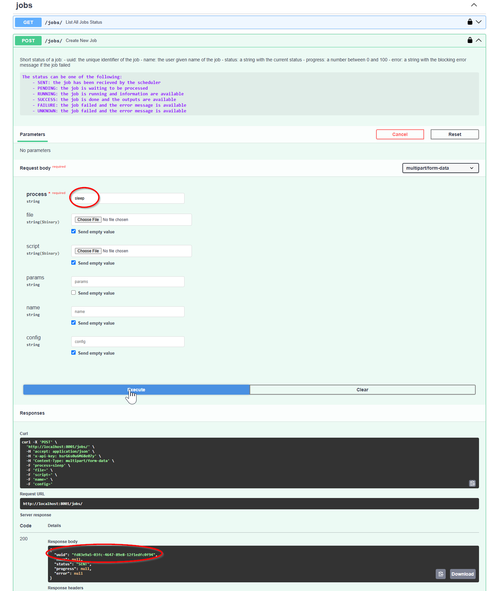
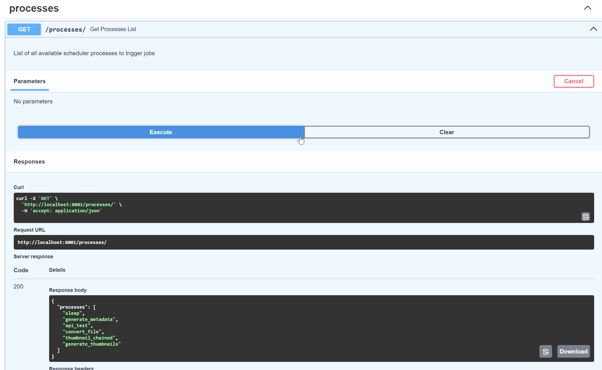

# Pixyz Scheduler User Guide
<!-- TOC -->
* [Pixyz Scheduler User Guide](#pixyz-scheduler-user-guide)
  * [API and tools](#api-and-tools)
  * [How to submit jobs](#how-to-submit-jobs)
    * [Testing the worker](#testing-the-worker)
      * [Submit a simple job through the web interface](#submit-a-simple-job-through-the-web-interface)
      * [Submit a simple job through the API](#submit-a-simple-job-through-the-api)
    * [Job with input and output](#job-with-input-and-output)
      * [Submit a job with a 3D file](#submit-a-job-with-a-3d-file)
      * [Get the result file](#get-the-result-file)
        * [Get a single file](#get-a-single-file)
        * [Get whole output](#get-whole-output)
          * [425 Client Error: Too Early](#425-client-error-too-early)
          * [Zip caching and repack](#zip-caching-and-repack)
      * [Submit a job with a zip file and parameter](#submit-a-job-with-a-zip-file-and-parameter)
    * [Use a special queue for your script](#use-a-special-queue-for-your-script)
    * [Use a pre-registered script (process)](#use-a-pre-registered-script-process)
      * [How to get the list of available scripts](#how-to-get-the-list-of-available-scripts)
        * [From the web interface](#from-the-web-interface)
        * [From the command line](#from-the-command-line)
      * [How to get the documentation of a script](#how-to-get-the-documentation-of-a-script)
        * [From the web interface](#from-the-web-interface-1)
        * [From the command line](#from-the-command-line-1)
      * [How to use a pre-registered script](#how-to-use-a-pre-registered-script)
        * [From the web interface](#from-the-web-interface-2)
        * [From the command line](#from-the-command-line-2)
      * [How to create a new pre-registered script](#how-to-create-a-new-pre-registered-script)
        * [Existing sample scripts](#existing-sample-scripts)
  * [Understanding the job status](#understanding-the-job-status)
    * [uuid](#uuid)
    * [entrypoint](#entrypoint)
    * [queue](#queue)
    * [time_limit](#time_limit)
    * [status](#status)
    * [progress](#progress)
    * [error](#error)
      * [Error internal process (exit != 0)](#error-internal-process-exit--0)
    * [time_info](#time_info)
    * [steps](#steps)
    * [result](#result)
    * [Troubleshooting](#troubleshooting)
        * [File with nested files](#file-with-nested-files)
        * [Large file](#large-file)
  * [How it processes jobs](#how-it-processes-jobs)
    * [Queue usage](#queue-usage)
    * [Retry policy](#retry-policy)
<!-- TOC -->
## API and tools

* [Swagger](http://localhost:8001/docs): test the Scheduler API.
* [ReDoc](http://localhost:8001/redoc): Scheduler API documentation.
* [Task Monitor](http://localhost:5555): Flower (if deployed) to monitor tasks.

| Flower monitoring must be started before Celery to catch all events

## How to submit jobs
Firstly, you have to [test your installation](./test_install.md). After that, If everything is working, you can submit a job to the scheduler through the API.

We provide a python client to interact with the API. You can find it in the `client.py` file.

`YOUR_TOKEN` is the token you will use to authenticate to the worker. It is a string of your choice (see `.env` file and the `GOD_PASSWORD_SHA256`).

| On Windows host, `localhost` can differ from `127.0.0.1`. Always use `localhost`. 


### Testing the worker
#### Submit a simple job through the web interface
You can test the worker by submitting a simple job through the web interface. You can use the `sleep` script to test the worker.

1. Open your browser to http://127.0.0.1:8001 (8001 is the default `API_PORT`)
2. Go to the `Jobs` tab (POST/Create a new job)
3. Select:
   1. click on the lock icon to set the authentication token with your unhashed password
   2. keep the process name to custom
   3. on the file parameter, click to "send empty value"
   3. select a Pixyz script (e.g. `sleep`) located in the `pixyz_api/scripts/sleep.py`
   4. remove all parameters "string" in params, name, config field.
4. Click on the `Execute` button

Once the job is submitted, you will get a uuid of job.

you can see the job status in the `Jobs` tab. You can also see the job status in the `Tasks` tab.

#### Submit a simple job through the API
This job is very simple, because you don't need any 3D file, and it does not produce any output. 
It will just sleep for 0.1s.

```bash
`python ./client.py --url http://localhost:8001 exec -wr -s scripts/tutorial/00_sleep.py -t <YOUR_TOKEN>`

-------- New PixyzScheduler Job ---------
- script file:  'scripts/tutorial/00_sleep.py'
- script params:  {}
- worker config:  {"entrypoint": "main", "queue": null, "time_limit": 3600}
-  watch status:  True
-----------------------------------------

Using 'x-api-key' authentication with provided token
Uploading...done
Job [ 2297b59c-ae6c-421d-8d2b-8040b337c0c5 ] started
Job [ 2297b59c-ae6c-421d-8d2b-8040b337c0c5 ] progress: 100, status: SUCCESS  [⏳]
{
    "uuid": "2297b59c-ae6c-421d-8d2b-8040b337c0c5",
    "name": null,
    "status": "SUCCESS",
    "progress": 100,
    "error": null,
    "time_info": {
        "request": "2024-12-17T07:51:30.017096",
        "started": "2024-12-17T07:51:30.273195+00:00",
        "stopped": "2024-12-17T07:51:30.499900+00:00"
    },
    "steps": [],
    "retry": 0,
    "result": null
}

```

### Job with input and output
#### Submit a job with a 3D file
```bash
python ./client.py --url http://localhost:8001 exec -s scripts/tutorial/00_convert_a_file.py -i ~/windows/cadfile/panda.fbx -wr -t <YOUR_TOKEN>`
-------- New PixyzScheduler Job ---------
- script file:  'scripts/tutorial/00_convert_a_file.py'
-  input file:  '/home/dmx/windows/cadfile/panda.fbx'
- script params:  {}
- worker config:  {"entrypoint": "main", "queue": null, "time_limit": 3600}
-  watch status:  True
-----------------------------------------

Using 'x-api-key' authentication with provided token
Uploading...done
Job [ a1fcf81a-8c8b-4379-8072-a4879d4d15b2 ] started
Job [ a1fcf81a-8c8b-4379-8072-a4879d4d15b2 ] progress: 100, status: SUCCESS (Exporting file to /share/a1fcf81a-8c8b-4379-8072-a4879d4d15b2/outputs/output.pxz) [⌛]
{
    "uuid": "a1fcf81a-8c8b-4379-8072-a4879d4d15b2",
    "name": null,
    "status": "SUCCESS",
    "progress": 100,
    "error": null,
    "time_info": {
        "request": "2024-12-17T08:56:45.793692",
        "started": "2024-12-17T08:56:45.908315+00:00",
        "stopped": "2024-12-17T08:56:53.346583+00:00"
    },
    "steps": [
        {
            "duration": 7.236645183000292,
            "info": "Importing file /app/share/a1fcf81a-8c8b-4379-8072-a4879d4d15b2/inputs/panda.fbx"
        },
        {
            "duration": 0.11264890799975547,
            "info": "Exporting file to /share/a1fcf81a-8c8b-4379-8072-a4879d4d15b2/outputs/output.pxz"
        },
        {
            "duration": 0.034947275000376976,
            "info": "done"
        }
    ],
    "retry": 0,
    "result": {
        "output": "output.pxz"
    }
}
```
Convert a file from a FBX file format to PXZ file .

#### Get the result file
In the configuration setup, if you set the `CLEANUP_ENABLED` parameter to `true`, all input and output files will be removed after the `CLEANUP_DELAY`.

This parameter is highly recommended in production to avoid disk space saturation. In development, you can set it to `false` to keep the files for debugging.

##### Get a single file
You can download the result file with the following command:
```bash
python ./client.py --url http://localhost:8001 download -j a1fcf81a-8c8b-4379-8072-a4879d4d15b2 -f output.pxz -o myoutput.pxz -t <YOUR_TOKEN> 
Job [ a1fcf81a-8c8b-4379-8072-a4879d4d15b2 ] output 'output.pxz' downloaded to 'myoutput.pxz' (42.2MiB)
```
You have to provide the `jobid` and the relative job file path. The file will be downloaded to the current directory with the name `myoutput.pxz`.

##### Get whole output
You can download the whole output directory as a zip archive with the following command:
```bash
python ./client.py --url http://localhost:8001 download_all -j a1fcf81a-8c8b-4379-8072-a4879d4d15b2 -o output.zip -t <YOUR_TOKEN>
```

This command will:
* create a new job to zip the output directory
* put the job in the zip queue
* wait for the job to finish
* download the zip file


###### 425 Client Error: Too Early
If some case, the API will call the worker to zip the output directory and try to the job status before the job is submitted. In this case, you will receive an error message:
```requests.exceptions.HTTPError: 425 Client Error: Too Early for url: ...```

Don't worry, you can retry the command after a few seconds.


###### Zip caching and repack
By default, the zip file is cached. If you want to force the zip creation, you can use the `--repack` option. 

TODO DMX: add the repack option to zip archive

#### Submit a job with a zip file and parameter
In this example, we will submit a job with a zip file and a script parameter. In this case, the Pixyz Scheduler will detect the zip file and extract it to the worker's shared storage.

Because, the Pixyz Scheduler can't determine the name of the input file, you have to provide the name of the input file in the script parameter. This is under the **developer** responsability to manage the input file.

For example, with this zip file which contains a 3D files with nested files.

```bash
zipinfo dmx/Brakes.zip 
Archive: dmx/Brakes.zip
Zip file size: 7459025 bytes, number of entries: 21
-rw-a--     6.3 fat    15647 bx defN 17-Jul-27 19:02 BoltA.1.CATProduct
-rw-a--     6.3 fat   144865 bx defN 17-Jul-27 19:02 Bolt_Part1A.1.CATPart
-rw-a--     6.3 fat   178947 bx defN 17-Jul-27 19:02 Bolt_Part2A.1.CATPart
-rw-a--     6.3 fat    60741 bx defN 17-Jul-27 19:02 Bolt_Part3A.1.CATPart
-rw-a--     6.3 fat   113798 bx defN 17-Jul-27 19:02 Bolt_Part4A.1.CATPart
-rw-a--     6.3 fat  3656263 bx defN 17-Jul-27 19:02 Brakes_Back_PartA.1.CATPart
-rw-a--     6.3 fat    14156 bx defN 17-Jul-27 19:02 Brakes_Front_PartA.1.CATProduct
-rw-a--     6.3 fat    15796 bx defN 17-Jul-27 19:02 Caliper_Part1A.1.CATProduct
-rw-a--     6.3 fat  3390961 bx defN 17-Jul-27 19:02 Caliper_Part1_01A.1.CATPart
-rw-a--     6.3 fat   155740 bx defN 17-Jul-27 19:02 Caliper_Part1_02A.1.CATPart
-rw-a--     6.3 fat   121601 bx defN 17-Jul-27 19:02 Caliper_Part1_03A.1.CATPart
-rw-a--     6.3 fat   247043 bx defN 17-Jul-27 19:02 Caliper_Part1_04A.1.CATPart
-rw-a--     6.3 fat  5800579 bx defN 17-Jul-27 19:02 Caliper_Part2A.1.CATPart
-rw-a--     6.3 fat   253384 bx defN 17-Jul-27 19:02 Caliper_Part3A.1.CATPart
-rw-a--     6.3 fat    76023 bx defN 17-Jul-27 19:02 Caliper_Part4A.1.CATPart
-rw-a--     6.3 fat   421218 bx defN 17-Jul-27 19:02 Caliper_Part6A.1.CATPart
-rw-a--     6.3 fat    88707 bx defN 17-Jul-27 19:02 Caliper_Part7A.1.CATPart
-rw-a--     6.3 fat  1250473 bx defN 17-Jul-27 19:02 CoverA.1.CATPart
-rw-a--     6.3 fat  4201961 bx defN 17-Jul-27 19:02 Front_Disc_3PartsA.1.CATPart
-rw-a--     6.3 fat   717724 bx defN 17-Jul-27 19:02 HubA.1.CATPart
-rw-a--     6.3 fat    32368 bx defN 17-Jul-27 19:02 _PiXYZ-DEMO-BRAKES.CATProduct
21 files, 20957995 bytes uncompressed, 7455647 bytes compressed:  64.4%
```

We submit a job with a dictionary parameter to convert the `_PiXYZ-DEMO-BRAKES.CATProduct` file to a FBX file:
* filename: the name of the file to convert
* extension: the extension of the output file

The developer can use these parameters as his script needs.

```bash
python ./client.py --url http://localhost:8001 exec -s scripts/tutorial/00_convert_a_file.py -i ~/windows/cadfile/Brakes.zip -p '{"filename": "_PiXYZ-DEMO-BRAKES.CATProduct", "extension": "fbx"}'  -wr -t <YOUR_TOKEN>  
- script file:  'scripts/tutorial/00_convert_a_file.py'
-  input file:  '/home/dmx/windows/cadfile/Brakes.zip'
- script params:  {"filename": "_PiXYZ-DEMO-BRAKES.CATProduct", "extension": "fbx"}
- worker config:  {"entrypoint": "main", "queue": null, "time_limit": 3600}
-  watch status:  True
-----------------------------------------

Using 'x-api-key' authentication with provided token
Uploading...done
Job [ c9fd7459-e595-4277-91c4-d5155e29046c ] started
Job [ c9fd7459-e595-4277-91c4-d5155e29046c ] progress: 100, status: SUCCESS (Exporting file to /share/c9fd7459-e595-4277-91c4-d5155e29046c/outputs/output.fbx) [⏳]
{
    "uuid": "c9fd7459-e595-4277-91c4-d5155e29046c",
    "name": null,
    "status": "SUCCESS",
    "progress": 100,
    "error": null,
    "time_info": {
        "request": "2024-12-17T10:22:03.510743",
        "started": "2024-12-17T10:22:03.528728+00:00",
        "stopped": "2024-12-17T10:22:18.295737+00:00"
    },
    "steps": [
        {
            "duration": 0.14735440599906724,
            "info": "Extracting archive"
        },
        {
            "duration": 14.55351088200041,
            "info": "Importing file /tmp/tmpd_jw7ys9/Caliper_Part1A.1.CATProduct"
        },
        {
            "duration": 0.02316253899880394,
            "info": "Exporting file to /share/c9fd7459-e595-4277-91c4-d5155e29046c/outputs/output.fbx"
        },
        {
            "duration": 0.03682760300034715,
            "info": "done"
        }
    ],
    "retry": 0,
    "result": {
        "output": "output.fbx"
    }
}

```

### Use a special queue for your script
If you have specialized workers for GPU workloads, you can submit your job to the `gpu` queue. You have two possibilities to submit your job to the `gpu` queue:
* Use the `--queue` option in the command line
* Use the `queue` parameter in the script (`pixyz_schedule` decorator)

:warning: If you use a gpu queue, please be sure that you have enable the gpu acceleration in the host (see NVIDIA driver installation) or docker configuration (see `compose.yaml` and add the commented GPU option). Otherwise:
* specialized job like createGPUScene will be software emulated and very slow
* highly specialized job like hiddenRemoval will fail

```bash
python ./client.py --url http://localhost:8001 exec -s scripts/tutorial/01_workflow_engine.py -i ~/windows/cadfile/panda.fbx -wr --queue gpu -t <YOUR_TOKEN>                     
                                                                                                                                                                                                                                               
-------- New PixyzScheduler Job ---------                                                                                                                                                                                                      
- script file:  'scripts/tutorial/01_workflow_engine.py'                                                                                                                                                                                       
-  input file:  '/home/dmx/windows/cadfile/panda.fbx'                                                                                                                                                                                          
- script params:  {}                                                                                                                                                                                                                           
- worker config:  {"entrypoint": "main", "queue": "gpu", "time_limit": 3600}                                                                                                                                                                   
-  watch status:  True                                                                                                                                                                                                                         
-----------------------------------------                                                                                                                                                                                                      
                                                                                                                                                                                                                                               
Using 'x-api-key' authentication with provided token                                                                                                                                                                                           
Uploading...done                                                                                                                                                                                                                               
Job [ ba007728-266c-44d3-ac00-d6519508a0b9 ] started                                                                                                                                                                                           
Job [ ba007728-266c-44d3-ac00-d6519508a0b9 ] progress: 100, status: SUCCESS (Export To GLB) [⏳]                                                                                                                                               
{                                                                                                                                                                                                                                              
    "uuid": "ba007728-266c-44d3-ac00-d6519508a0b9",                                                                                                                                                                                            
    "name": null,                                                                                                                                                                                                                              
    "status": "SUCCESS",                                                                                                                                                                                                                       
    "progress": 100,                                                                                                                                                                                                                           
    "error": null,                                                                                                                                                                                                                             
    "time_info": {                                                                                                                                                                                                                             
        "request": "2024-12-17T13:07:35.256038",                                                                                                                                                                                               
        "started": "2024-12-17T13:07:35.288915+00:00",                                                                                                                                                                                         
        "stopped": "2024-12-17T13:08:06.419787+00:00"                                                                                                                                                                                          
    },                                                                                                                                                                                                                                         
    "steps": [                                                                                                                                                                                                                                 
        {                                                                                                                                                                                                                                      
            "duration": 6.50257152300037,                                                                                                                                                                                                      
            "info": "Importing file"
        },                       
        {                       
            "duration": 0.013731155002460582,
            "info": "Repairing CAD"             
        },                                            
        {                                            
            "duration": 0.06991862999711884, 
            "info": "Repairing Mesh" 
        },                              
        {                                
            "duration": 0.011438535002525896,
            "info": "tessellateRelativelyToAABB"
        },
        {
           "duration": 1.9601412459996936,
            "info": "Creating viewer"
        },
        {
            "duration": 0.1694992339980672,
            "info": "Creating GPUScene"
        },
        {
            "duration": 15.339383601000009,
            "info": "Screenshotting"
        },
        {
            "duration": 0.03622663400165038,
            "info": "Combine Material"
        },
        {
            "duration": 0.008971169998403639,
            "info": "DecimateTarget"
        },
        {
            "duration": 6.891589749000559,
            "info": "Export To GLB"
        },
        {
            "duration": 0.05525317499996163,
            "info": "Generating metadata"
        }
        ],
    "retry": 0,
        "result": {
            "thumbs": {
                "iso": "/share/ba007728-266c-44d3-ac00-d6519508a0b9/outputs/iso.png",
                "x": "/share/ba007728-266c-44d3-ac00-d6519508a0b9/outputs/x.png",
                "y": "/share/ba007728-266c-44d3-ac00-d6519508a0b9/outputs/y.png",
                "z": "/share/ba007728-266c-44d3-ac00-d6519508a0b9/outputs/z.png"
            },
            "preview": {
                "file": "output.glb",
                "size": "512x512"
            },
            "metadata": {
                "aabb": "2400.475224659244",
                "part_count": 2,
                "material_count": 2,
                "brep_boundary": 0,
                "brep_body_count": 0,
                "mesh_boundary": 45,
                "mesh_edge_count": 48575,
                "mesh_vertex_count": 17591,
                "polygon_count": 31000,
                "animation_count": 1,
                "variant_count": 0,
                "pmi_component_count": 0,
                "annotation_group_count": 0,
                "annotation_count": 0,
                "metadata_component_count": 0,
                "metadata_property_count": 0
            },
            "process_duration": 31.031435
        }
    }
```
### Use a pre-registered script (process)
The Pixyz Scheduler permits to use a pre-defined script. These scripts are stored in a dedicated `process` directory.

The user can use these scripts without any knowledge of the script content.

We provide some sample scripts in the `process` directory:
* `api_test.py`: a simple script to test the API
* `convert_a_file.py`: a script to convert a file from a format to another
* `generate_metadata.py`: a script to generate metadata from a 3D file
* `generate_thumbnails.py`: a script to generate thumbnails from a 3D file
* `sleep.py`: a script to sleep for a while (for testing purpose)
* `thumbnail_chained.py`: a complex and chained script (from cpu to gpu) that generate thumbnails from a given 3D file 

#### How to get the list of available scripts
##### From the web interface
You can get the list of available scripts from the web interface. You have to go to the `process` tab:


##### From the command line
For example, from the `localhost`:
```bash
curl -X 'GET' \
  'http://localhost:8001/processes/' \
  -H 'accept: application/json'
  
{"processes":["sleep","generate_metadata","api_test","convert_file","thumbnail_chained","generate_thumbnails"]}
```

#### How to get the documentation of a script
##### From the web interface
For example, from the `localhost` with the script `convert_file`
[process_web_convert](./img/process_web_convert.png)
##### From the command line
For example, from the `localhost`:
```bash
curl -X 'GET' \
  'http://localhost:8001/processes/convert_file' \
  -H 'accept: application/json'

{"doc":"Process 'convert_file' documentation:\n\nConverts a file to a different format\n\nParameters\n{\n'extension': 'ext', [optional] output file format (default: pxz)\n'filename': 'name', [optional] output file name (default: input file name)\n} "}
```
#### How to use a pre-registered script
##### From the web interface
When you submit a job, you can set the script in the `process` field

##### From the command line
```bash
python ./client.py --url http://localhost:8001 process -n api_test -wr -t <YOUR_TOKEN>  
start api_test process
                                                           
-------- New PixyzScheduler Job ---------
- process:  'api_test'
- script params:  {}
- worker config:  {"entrypoint": "main", "queue": null, "time_limit": 3600}
-  watch status:  True
-----------------------------------------          
                                                           
Using 'x-api-key' authentication with provided token
done                
Job [ de8c8da4-93b2-4b6b-9240-a308e273da80 ] started
Job [ de8c8da4-93b2-4b6b-9240-a308e273da80 ] progress: 100, status: SUCCESS  [⏳]
{                                               
    "uuid": "de8c8da4-93b2-4b6b-9240-a308e273da80",   
    "name": null,                                    
    "status": "SUCCESS",
    "progress": 100,
    "error": null,
    "time_info": {                          
        "request": "2024-12-18T05:10:05.892319",
        "started": "2024-12-18T05:10:05.933408+00:00",
        "stopped": "2024-12-18T05:10:06.050871+00:00"
    },         
    "steps": [ 
        {                        
            "duration": 0.03399073700029476,
            "info": "API tested successfully!"
        }
    ],
    "retry": 0,
    "result": {
        "output": "Hello World!",
        "params": {}
    }
}
Job [ de8c8da4-93b2-4b6b-9240-a308e273da80 ] completed
{
    "uuid": "de8c8da4-93b2-4b6b-9240-a308e273da80",
    "name": null,
    "status": "SUCCESS",
    "progress": 100,
    "error": null,
    "time_info": {
        "request": "2024-12-18T05:10:05.892319",
        "started": "2024-12-18T05:10:05.933408+00:00",
        "stopped": "2024-12-18T05:10:06.050871+00:00"
    },
    "steps": [
        {
            "duration": 0.03399073700029476,
            "info": "API tested successfully!"
        }
    ],
    "retry": 0,
    "result": {
        "output": "Hello World!",
        "params": {}
    }
}
                                                                                   
```
#### How to create a new pre-registered script
Copy the script in the `process` directory available from the API node/host/container:
* local/dev mode (`DEBUG` mode enable): `./scripts/process`
* docker/docker-compose:
    * with DEBUG mode: mount the storage intot `./scripts/process` (`/app/scripts/process` inside the container)
    * without DEBUG mode: mount the storage intot `/process` (`/process` inside the container)

##### Existing sample scripts
* api_test.py: a simple script to test the API
* convert_a_file.py: a script to convert a file from a format to another
* generate_metadata.py: a script to generate metadata from a 3D file
* generate_thumbnails.py: a script to generate thumbnails from a 3D file
* sleep.py: a script to sleep for a while (for testing purpose)
* thumbnail_chained.py: a complex and chained script (from cpu to gpu) that generate thumbnails from a given 3D file


## Understanding the job status
### uuid
The job unique identifier, this number permits to get the status of the job.
The format is a UUID v4 (regexp `[0-9a-f]{8}-[0-9a-f]{4}-4[0-9a-f]{3}-[89ab][0-9a-f]{3}-[0-9a-f]{12}`). This uuid is created when the job is submitted.

### entrypoint
By default, the Pixyz Scheduler will execute the `main` function in your script, but you can change it with the parameter `--entrypoint`

### queue
The queue where the job is submitted. By default, the queue is `None` and the Pixyz Scheduler will choose the `cpu` queue for the job.

### time_limit
This is the maximum time the job can run. By default, the time limit is 3600s (1 hour).

### status
The status of the job. It can be `PENDING`, `STARTED`, `SUCCESS`, `FAILURE`, `RETRY`, `REVOKED`, `RECEIVED`, `REJECTED`, `RETRY`, `STARTED`.

| Status   | Description                       |
|----------|-----------------------------------|
| PENDING  | The job is waiting to be          |
| STARTED  | The job is running                |           
| SUCCESS  | The job is finished without error | 
| FAILURE  | The job is finished with an error |
| RETRY    | The job is waiting to be retried  |
| REVOKED  | The job is canceled               |
| RECEIVED | The job is received by the worker |
| REJECTED | The job is rejected by the worker |
| STARTED  | The job is started by the worker  |

### progress
The progress of the job. It is a percentage of the job completion. This field is not mandatory and can be omitted.
The script developer can update the progress by using the `update_progress` function.

### error
Report the error if the job failed. This field will contain the backtrace in case of an error.

#### Error internal process (exit != 0)
```
Traceback (most recent call last):
  File "/app/pixyz_worker/tasks.py", line 249, in pixyz_execute
    ret = SignalSafeExecution.run(ExternalPythonCode(pc['script']).execute, pc,
  File "/app/pixyz_worker/extcode.py", line 204, in run
    raise PixyzExitFault(process.exitcode)
pixyz_worker.exception.PixyzExitFault: PixyzExitFault: 1

During handling of the above exception, another exception occurred:

Traceback (most recent call last):
  File "/usr/local/lib/python3.10/dist-packages/celery/app/trace.py", line 453, in trace_task
    R = retval = fun(*args, **kwargs)
  File "/usr/local/lib/python3.10/dist-packages/celery/app/trace.py", line 736, in __protected_call__
    return self.run(*args, **kwargs)
  File "/usr/local/lib/python3.10/dist-packages/celery/app/autoretry.py", line 38, in run
    return task._orig_run(*args, **kwargs)
  File "/app/pixyz_worker/tasks.py", line 277, in pixyz_execute
    update_state_and_raise_a_failure(self, exc)
  File "/app/pixyz_worker/tasks.py", line 186, in update_state_and_raise_a_failure
    raise exc
  File "/app/pixyz_worker/tasks.py", line 263, in pixyz_execute
    retry_on_pixyz_fault_with_raise(self, exc)
  File "/app/pixyz_worker/tasks.py", line 133, in retry_on_pixyz_fault_with_raise
    raise task.retry(**params)
  File "/usr/local/lib/python3.10/dist-packages/celery/app/task.py", line 737, in retry
    raise self.MaxRetriesExceededError(
celery.exceptions.MaxRetriesExceededError: Can't retry pixyz_execute[325cfb5f-2ba1-4ee2-9705-9038f677a78c] args:({}, {'task_id': '325cfb5f-2ba1-4ee2-9705-9038f677a78c', 'script': '/app/share/325cfb5f-2ba1-4ee2-9705-9038f677a78c/inputs/00_convert_a_file.py', 'data': '/app/share/325cfb5f-2ba1-4ee2-9705-9038f677a78c/inputs/panda.fbx', 'root_file': None, 'time_request': datetime.datetime(2024, 12, 17, 8, 22, 13, 356058), 'time_limit': 3600, 'entrypoint': 'main', 'compute_only': False, 'shadow': None, 'queue': 'cpu', 'tmp': True, 'is_local': False, 'raw': False}) kwargs:{}
```
You have reached the maximum number of retries. The job is canceled. And the error is related to a bad script execution exit or an internal error like an invalid license   

### time_info
This field contains the time information about the job. It contains the:
* `request_time`: When the API receives the request
* `start_time`: When the worker starts the job
* `stop_time`: When the worker finishes the job

### steps
This field contains the steps of the job. It is an array of objects with the following fields:
* `duration`: The duration of the step in seconds
* `info`: The information about the step

This information is not mandatory and can be omitted.

```json
{
  "steps": [
    {
      "duration": 7.236645183000292,
      "info": "Importing file /app/share/a1fcf81a-8c8b-4379-8072-a4879d4d15b2/inputs/panda.fbx"
    },
    {
      "duration": 0.11264890799975547,
      "info": "Exporting file to /share/a1fcf81a-8c8b-4379-8072-a4879d4d15b2/outputs/output.pxz"
    },
    {
      "duration": 0.034947275000376976,
      "info": "done"
    }
  ]
}
```

### result
This field contains the result of the job. It is a dictionary with arbitrary keys and values. 


### Troubleshooting
##### File with nested files
Some CAD format can contain nested files. The Pixyz Scheduler can perform these files, but we need to upload an archive like zip, or tar.gz. The Pixyz Scheduler will extract the archive and put the files in the shared storage.
But the script developer has to manage the main files.

##### Large file
The Pixyz Scheduler can handler large files, but in enterprise configuration with a reverse proxy, you should have to change the maximum POST size in the reverse proxy configuration.

* nginx: change the `client_max_body_size` parameter in the `nginx.conf` file.
* apache: change the `LimitRequestBody` parameter in the `httpd.conf` file.


## How it processes jobs
The Pixyz Scheduler uses the producer-consumer pattern to distribute tasks to workers. The tasks are sent to different queues (`cpu`, `gpu`, ...) and the workers are listening to these queues.

### Queue usage
The queues are defined by the workers required capabilities. The following queues are available:

| Queue   | usage                                                                                                                                                  | scheduling                 | possible mode | next queue       |
|---------|--------------------------------------------------------------------------------------------------------------------------------------------------------|----------------------------|---------------|------------------|
| clean   | once the job is finished, a cleaning task is scheduled by Pixyz Scheduler to remove input and output files. (see. `CLEANUP_*` configuration variables) | after job submission       | PREFORK       | auto retry       |
| zip     | for all tasks that need to zip the output file processed                                                                                               | in job submission          | PREFORK       | auto retry       |
| control | for all tasks that need to control the workers. This queue is used for the control tasks and start new tasks.                                          | in job submission          | PREFORK       | auto retry       |
| cpu     | for all tasks that can be executed on a CPU                                                                                                            | in job submission          | SOLO          | retry on gpuhigh |
| gpu     | for all tasks that can be executed on a GPU                                                                                                            | in job submission          | SOLO          | retry on gpuhigh |
| gpuhigh | for all tasks that need to execute on a high-end GPU (dedicated hosts) or for previously failed tasks on low resources computers                       | in job submission or retry | SOLO          | failure          |

### Retry policy
When a task fails, the Pixyz Scheduler will retry the task on the next queue according to the table above. 
For `clean`, `control` or `zip` tasks, the retry is done on the same queue.  


