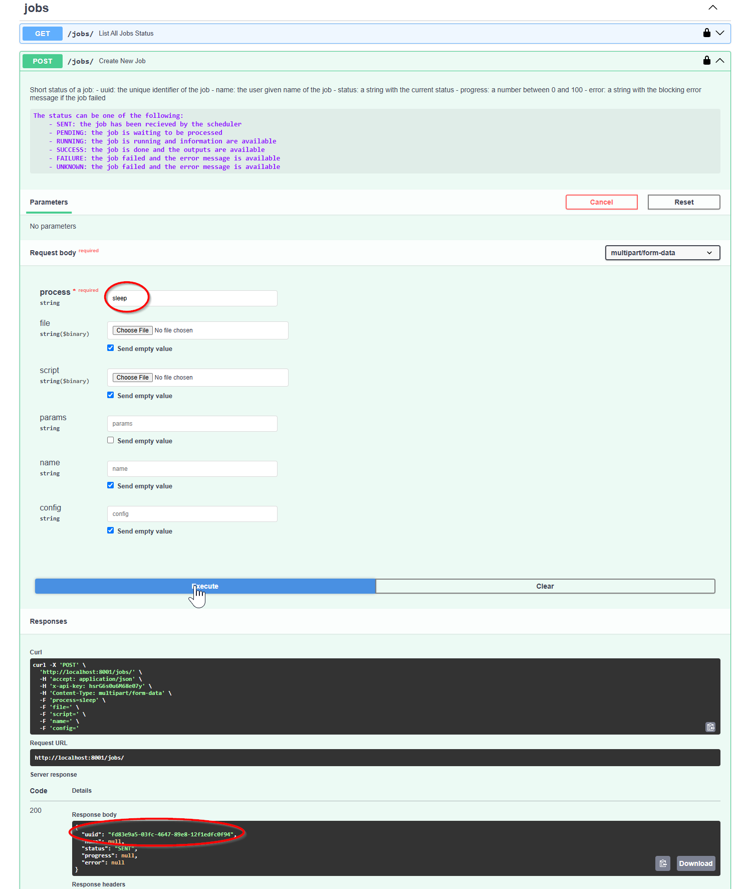

# Test the installation
## API
### from the browser
1. Test that your API is up and running: 
   * Open your browser and go to `http://localhost:8001/docs`. You should see the FastAPI documentation page.
2. Test that your redis is available through the API by getting the list of jobs: 
   * Open your browser and go to `http://localhost:8001/docs`.
   * Fill the authorization token (in cleartext) with the value `Bearer your_token` (replace `your_token` with the non hashed value of your GOD_PASSWORD_SHA256 stored in `.env` file).
   * 
3. You must see an empty list of jobs in the response.

### from the client
```bash
python client.py -u http://127.0.0.1:8001 jobs --token PASSWORD
{
    "jobs": []
}
```
## Worker
For testing the worker, you can use the `sleep` process that will sleep for a given amount of time.

### from the web interface
1. Open your browser and go to `http://localhost:8001/docs`.
2. Authorize the API with the token `Bearer your_token` (replace `your_token` with the non hashed value of your GOD_PASSWORD_SHA256 stored in `.env` file).
3. Go to the `process` endpoint and click on the `Try it out` button. And create a new job with the following parameters:
   * 
   * process: sleep
   * Get the process uuid after submit
4. Go to the status endpoint and click on the `Try it out` button. And get the status of the job with the uuid you got in the previous step.
   * 
### from the client
```bash
python client.py -u http://127.0.0.1:8001 process -n sleep -t PASSWORD -wr
start sleep process

-------- New PixyzScheduler Job ---------
- process:  'sleep'
- script params:  {}
- worker config:  {"entrypoint": "main", "queue": null, "time_limit": 3600}
-  watch status:  True
-----------------------------------------

Using 'x-api-key' authentication with provided token
done
Job [ e3b57b20-35cb-4c82-8b63-6c018979be4e ] started
Job [ e3b57b20-35cb-4c82-8b63-6c018979be4e ] progress: 100, status: SUCCESS  [⏳]
{
    "uuid": "e3b57b20-35cb-4c82-8b63-6c018979be4e",
    "name": null,
    "status": "SUCCESS",
    "progress": 100,
    "error": null,
    "time_info": {
        "request": "2024-12-11T10:18:10.330667",
        "started": "2024-12-11T10:18:10.345332+00:00",
        "stopped": "2024-12-11T10:18:10.463219+00:00"
    },
    "steps": [
        {
            "duration": 0.11222426999938762,
            "info": "Sleeping for 0.1 seconds"
        }
    ],
    "retry": 0,
    "result": {
        "sleep": 0.1
    }
}
Job [ e3b57b20-35cb-4c82-8b63-6c018979be4e ] completed
{
    "uuid": "e3b57b20-35cb-4c82-8b63-6c018979be4e",
    "name": null,
    "status": "SUCCESS",
    "progress": 100,
    "error": null,
    "time_info": {
        "request": "2024-12-11T10:18:10.330667",
        "started": "2024-12-11T10:18:10.345332+00:00",
        "stopped": "2024-12-11T10:18:10.463219+00:00"
    },
    "steps": [
        {
            "duration": 0.11222426999938762,
            "info": "Sleeping for 0.1 seconds"
        }
    ],
    "retry": 0,
    "result": {
        "sleep": 0.1
    }
}
```
