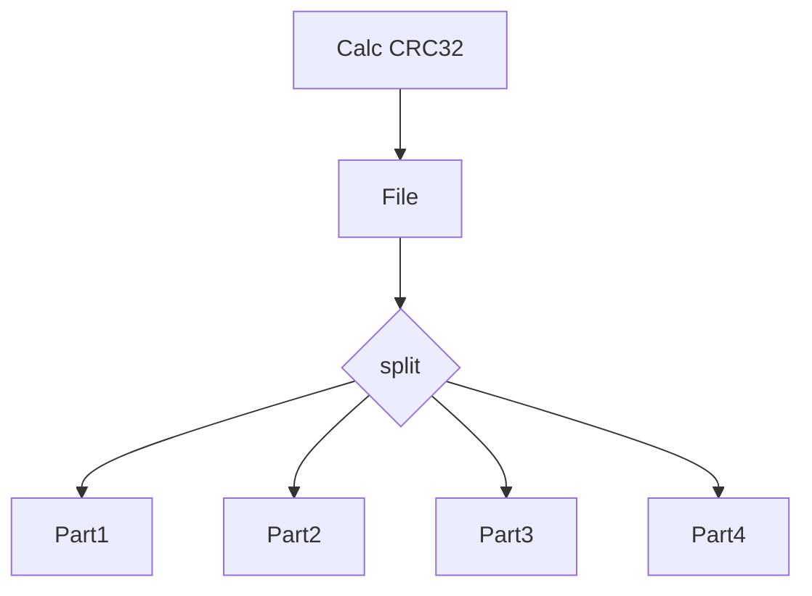
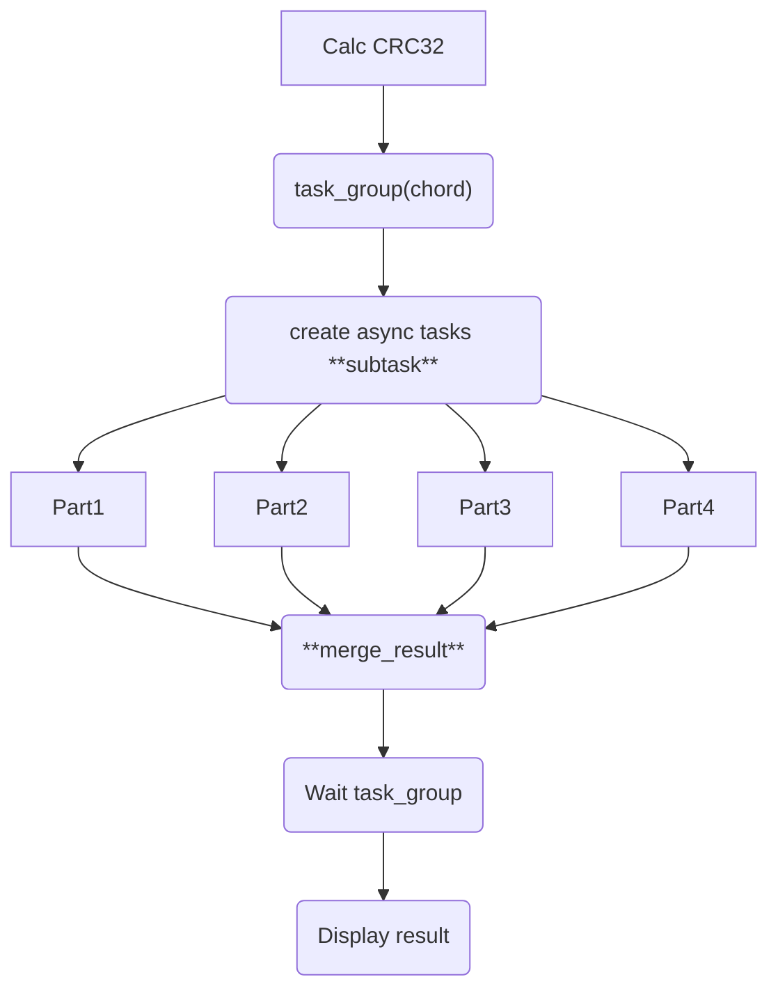
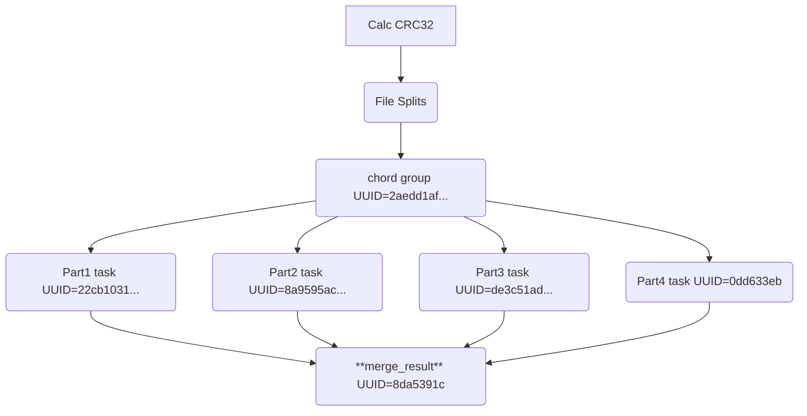
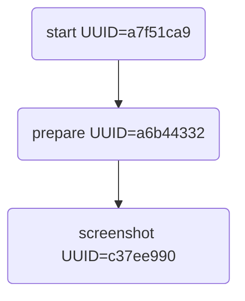

# Run sample
## Local execution
To run the sample scripts locally, you need to have:
* Python 3 installed along with the required dependencies
* a valid Pixyz license.
* a pixyz-scheduler.conf in the launch path or declare PIXYZ_PYTHON_PATH variable with the path or pxz python in the path.

## Through the Pixyz Scheduler
Please replace:
* the `-u` URL with your server address.
* the `-t` with your password.

# Tutorial scripts
## 00_convert_a_file.py
Convert a file from one format to another.

### Local execution
```bash
# with parameters
python3 scripts/tutorial/00_convert_a_file.py /home/dmx/windows/PanDaDance.fbx glb
...
Exporting file to /home/dmx/work/pixyz-scheduler/output.glb

# without parameters
python3 scripts/tutorial/00_convert_a_file.py /home/dmx/windows/PanDaDance.fbx
...
Exporting file to /home/dmx/work/pixyz-scheduler/output.pxz


````

### Remote execution
```bash
# Run the client with the script to convert a file.
python3 client.py -u http://127.0.0.1:8001 exec -t $PASSWORD -s ./scripts/tutorial/00_convert_a_file.py -i ~/windows/PanDaDance.fbx -rw

# Get a zip with the converted file. (get the UUID of the job from the output of the previous command)
python3 client.py -u http://127.0.0.1:8001 download_all -t $PASSWORD -j fa8675a8-95a5-4ef3-80ab-2b2222d11db6  -o /tmp/output.zip

# A file
python3 client.py -u http://127.0.0.1:8001 download -t $PASSWORD -j fa8675a8-95a5-4ef3-80ab-2b2222d11db6 -f output.pxz -o /tmp/output.pxz

# Run the scripts with parameters
python3 client.py -u http://127.0.0.1:8001 exec -t $PASSWORD -s ./scripts/tutorial/00_convert_a_file.py -i ~/windows/PanDaDance.fbx -p '{"extension":"glb"}' -rw

# Get the converted file
python3 client.py -u http://127.0.0.1:8001 download -t $PASSWORD -j fa8675a8-95a5-4ef3-80ab-2b2222d11db6 -f output.glb -o /tmp/output.glb
```

## 00_progress.py
This is a sample script to show how to use the progress bar and how you can execute the pixyz scheduler from a command line like a python script.

```bash
# Don't forget to install your python dependencies before running the script.
# A local execution of the script
python3 00_progress.py

# Through the pixyz scheduler
python3 client.py -u http://127.0.0.1:8001 exec -t $PASSWORD -s scripts/tutorial/00_progress.py -rw

-------- New PixyzScheduler Job ---------
- script file:  'scripts/tutorial/00_progress.py'
- script params:  {}
- worker config:  {"entrypoint": "main", "queue": null, "time_limit": 3600}
-  watch status:  True
-----------------------------------------

Uploading: [██████████████████████████████] 100.0% 

Job [ 5db96a3c-4cc1-458f-99e1-1db439693cb8 ] started
Job [ 5db96a3c-4cc1-458f-99e1-1db439693cb8 ] progress: 100, status: SUCCESS (Do something 1) [⌛]
{
    "uuid": "5db96a3c-4cc1-458f-99e1-1db439693cb8",
    "name": null,
    "status": "SUCCESS",
    "progress": 100,
    "error": null,
    "time_info": {
        "request": "2025-06-03T12:34:40.132448",
        "started": "2025-06-03T12:34:40.146062+00:00",
        "stopped": "2025-06-03T12:34:41.802041+00:00"
    },
    "steps": [
        {
            "duration": 0.11090524100018229,
            "info": "Do something 1"              <<<< First step in the script
        },
        {
            "duration": 1.2124247809997541,
            "info": "Do something 2"              <<<< Second step in the script
        }
    ],
    "retry": 0,
    "result": 1
```

## 01_workflow_engine.py
This script prepares a 3D model and take screenshots of it.
WARNING: You need a GPU for this script to work (or force `physical_gpu=False` in the script, but you will not get screenshots).

### Local execution
```bash
python3 ./scripts/tutorial/01_workflow_engine.py ~/windows/PanDaDance.fbx
...
[2025/06/04 16:09:44] [2025/06/04 16:09:44] Pixyz SDK (SDK v2025.1.2.3)
{'metadata': {'aabb': '2400.475224659244',
              'animation_count': 1,
              'annotation_count': 0,
              'annotation_group_count': 0,
              'brep_body_count': 0,
              'brep_boundary': 0,
              'material_count': 2,
              'mesh_boundary': 45,
              'mesh_edge_count': 48575,
              'mesh_vertex_count': 17591,
              'metadata_component_count': 1,
              'metadata_property_count': 2,
              'part_count': 2,
              'pmi_component_count': 0,
              'polygon_count': 31000,
              'variant_count': 0},
 'preview': {'file': 'output.glb', 'size': '512x512'},
 'process_duration': 9.739468}
```

### Remote execution
```bash
./client.py -u http://127.0.0.1:8001 exec -t $PASSWORD -s ./scripts/tutorial/01_workflow_engine.py -i ~/windows/PanDaDance.fbx -rw

# Download screenshots
python3 client.py -u http://127.0.0.1:8001 download -t $PASSWORD -j fa8675a8-95a5-4ef3-80ab-2b2222d11db6 -f x.png -o /tmp/x.png

# Download all files
python3 client.py -u http://127.0.0.1:8001 download_all -t $PASSWORD -j fa8675a8-95a5-4ef3-80ab-2b2222d11db6 -o /tmp/output.zip

```

## 02_celery_dag_sync.py
This is a sample script to show how to use the Pixyz Scheduler with Celery and how to create a DAG (Directed Acyclic Graph) of tasks.
This script will calculate the CRC32 of a file and split it into 4 parts.

There are multiple ways to perform a distributed task with Pixyz Scheduler/celery:
* create a controller task on the "control" queue that will way for the tasks to finish (not recommended). 
* totally decoupled tasks that will not wait for each other to finish (recommended)

### Local execution
Actually, this script is not designed to run locally as it uses the Pixyz Scheduler to create tasks and wait for them to finish. It may be supported in the future.

### Remote execution


This script will create tasks and wait for them to finish, then it will download the results to calculate the CRC32 of the file and split it into 4 parts.


The main advantage of this method is that you don't have to wait locally for the tasks to finish but you reserve a remote worker to execute the tasks.
This is the reason why we dedicated a queue `control` to this kind of tasks. The control queue is hosted on a dedicated worker with multiple process (forked) instead of compute node that run a single process.

## 02_celery_dag_async.py
This is the fully asynchronous version of the previous script. It will create tasks and does not wait for them to finish.

```bash
./client.py -u http://127.0.0.1:8001 exec -t $PASSWORD -s ./scripts/tutorial/02_celery_dag_async.py -i ~/windows/PanDaDance.fbx -rw

-------- New PixyzScheduler Job ---------
- script file:  './scripts/tutorial/02_celery_dag_async.py'
-  input file:  '/home/dmx/windows/PanDaDance.fbx'
- script params:  {}
- worker config:  {"entrypoint": "main", "queue": null, "time_limit": 3600}
-  watch status:  True
-----------------------------------------

Uploading: [██████████████████████████████] 100.0% 

Job [ 66516f29-5186-4c11-a281-04f742e1a87a ] started
Job [ 66516f29-5186-4c11-a281-04f742e1a87a ] progress: 100, status: SUCCESS (splitting file) [⏳]
{
    "uuid": "66516f29-5186-4c11-a281-04f742e1a87a",
    "name": null,
    "status": "SUCCESS",
    "progress": 100,
    "error": null,
    "time_info": {
        "request": "2025-06-05T08:35:19.826713",
        "started": "2025-06-05T08:35:19.850272+00:00",
        "stopped": "2025-06-05T08:35:19.968795+00:00"
    },
    "steps": [
        {
            "duration": 0.023919952996948268,
            "info": "splitting file"
        },
        {
            "duration": 0.04953581400332041,
            "info": "chord"
        }
    ],
    "retry": 0,
    "result": [
        [
            "8da5391c-d909-4b8f-b081-c8cc6b8a3d1f",
            [
                [
                    "2aedd1af-daff-460e-963e-0c0587bf4445",
                    null
                ],
                [
                    [
                        [
                            "22cb1031-cf4a-4134-a77e-e096daeecd94",
                            null
                        ],
                        null
                    ],
                    [
                        [
                            "8a9595ac-6873-4bca-b439-39b92227ddd4",
                            null
                        ],
                        null
                    ],
                    [
                        [
                            "de3c51ad-bb6d-48ac-910b-ebdef0a6e4a2",
                            null
                        ],
                        null
                    ],
                    [
                        [
                            "0dd633eb-45ba-423c-8cf0-186dd8a67609",
                            null
                        ],
                        null
                    ]
                ]
            ]
        ],
        null
    ]
}
````
The task automatically created 1 group with 4 subtasks and 1 aggregate task:

to get the result now, you have to follow the merge_step (the first in the list).

## 03_group_async.py
This script shows how to use the Pixyz Scheduler/celery to create a group of tasks that will run asynchronously.

## 04_chain_async.py
This script shows how to use the Pixyz Scheduler/celery to create a chain of tasks that will run asynchronously. The chain is complete when all tasks in the chain are finished.

## 05_chain_cpu_gpu_sync.py
This is the `01_workflow_engine.py` script but with a chain of tasks that will run asynchronously on CPU and GPU with a wait task.
The pixyz scheduler introduces a decorator to handle the process that will wait for the end of subtasks.
To do that, you can use `@pixyz_schedule(wait=True, timeout=3600)` to wait for the end of the subtasks.

## 05_chain_cpu_gpu_async.py
This is the same script as `05_chain_cpu_gpu_sync.py` but with a chain of tasks that will run asynchronously on CPU and GPU without waiting for the end of the subtasks.
The first id contains the parent task, you have to follow this step to get the result.

```bash
./client.py -u http://127.0.0.1:8001 exec -t $PASSWORD -s ./scripts/tutorial/05_chain_cpu_gpu_async.py -i ~/windows/PanDaDance.fbx -rw

-------- New PixyzScheduler Job ---------
- script file:  './scripts/tutorial/05_chain_cpu_gpu_async.py'
-  input file:  '/home/dmx/windows/PanDaDance.fbx'
- script params:  {}
- worker config:  {"entrypoint": "main", "queue": null, "time_limit": 3600}
-  watch status:  True
-----------------------------------------

Uploading: [██████████████████████████████] 100.0% 

Job [ a7f51ca9-1d1b-4a25-b384-a6eaa4adc7fb ] started
Job [ a7f51ca9-1d1b-4a25-b384-a6eaa4adc7fb ] progress: 100, status: SUCCESS  [⏳]
{
    "uuid": "a7f51ca9-1d1b-4a25-b384-a6eaa4adc7fb",     <<<<<< task that created the chain
    "name": null,
    "status": "SUCCESS",
    "progress": 100,
    "error": null,
    "time_info": {
        "request": "2025-06-05T11:55:40.526011",
        "started": "2025-06-05T11:55:40.568853+00:00",
        "stopped": "2025-06-05T11:55:40.767123+00:00"
    },
    "steps": [],
    "retry": 0,
    "result": [
        [
            "c37ee990-8526-4862-98e6-5229908511d8",   <<<<<< last in the chain
            [
                [
                    "a6b44332-419e-4303-a79d-5e04588c37bc", <<<<<< first in the chain
                    null
                ],
                null
            ]
        ],
        null
    ]
}
```
The task automatically created a chain of tasks:

